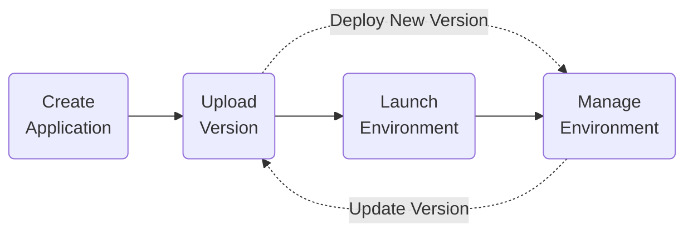

Elastic Beanstalk
==
Elastic Beanstalk allows you to quickly deploy and manage applications in the cloud without having to learn about the infrastructure that runs those applications.

To use Elastic Beanstalk, you create an application, upload an application version to Elastic Beanstalk, and then provide some information about the application. Elastic Beanstalk launches an environment and creates and configures the AWS resources needed to run your code. After your environment is launched, you can manage your environment and deploy new application versions. 


## Concepts
* An _**application**_ is a logical collection of components, including environments, versions, and environment configurations. In Elastic Beanstalk an application is conceptually similar to a folder.
* An _**application version**_ refers to a specific, labeled iteration of deployable code for a web application. An application version points to an S3 object that contains the deployable code (e.g., a ZIP or WAR file).
* An _**environment**_ is a collection of AWS resources running an application version. 
* An _**evironment tier**_ designates the type of application that the environment runs. There are two types of environment tiers:
    * A _web server_ environment tier serves HTTP requests.
    * A _worker_ environment tier is a backend environment that pulls tasks from an SQS queue.

## Deployment
To deploy a new version of your environment you upload an updated source bundle in the Elastic Beanstalk console. There are several deployment policies you can choose from:
* All at once: The new application version is deployed to each instance. Then, the web proxy or application server might need to restart during which time your application might be unavailable to users.
* Rolling: The new application version is deployed to a batch of instances, and the batch is restarted if needed. The process will repeat for all batches until every instance has the new application version. There will be some bandwidth lost as each batch goes out of service.
* Rolling with additional batch: A new batch of instances is created then a rolling is performed. There will be no loss of bandwidth. You will be charged for the additional instances that are started during deployment.
* Immutable: A new auto-scaling group is deployed running the new application version. The new instances serve traffic alongside the old version until the new instances pass health checks. This method provides a quick and safe rollback in case of a failed deployment.
* Traffic splitting: A canary testing deployment method. Suitable if you want to test the health of your new application version using a portion of incoming traffic, while keeping the rest of the traffic served by the old application version.

If a deployment fails for any reason, Elastic Beanstalk will roll back to the previous successful application version using the same method as the deployment.

## Applications
Every time you upload a new version of your application Elastic Beanstalk creates an application version.
* Elastic Beanstalk has the following quotas
    * 75 applications
    * 200 environments
    * 1000 application versions
* You can create lifecycle policies to delete older application versions.
* By default the application versions source bundle will remain in S3 after the application version is deleted.

## Environments
Elastic Beanstalk offers two environment types to run your application. You can switch your application between these environments as needed.
* A load-balanced, scalable environment uses Elastic Load Balancing, and EC2 Auto Scaling to provision new EC2 for your environment when you receive periods of heavy traffic.
* A single-instance environment contains one Amazon EC2 instance with an Elastic IP address. EC2 does use Auto Scaling to ensure unhealthy instances are terminated, but will not start new instances to handle increased traffic.

You can also use dedicated worker environments to perform long-running workflows without impacting your web applications performance. For example, you can use a worker environment to perform image processing while a user continues using the web app. Worker environments read messages from an SQS, and process them. You can also define periodic tasks in a file called `cron.yaml` in your source bundle. Messages will be added to your SQS queue based on the parameters defined in `cron.yaml`.

## Configurations
Elastic Beanstalk allows you to choose different EC2 instance types, define auto scaling health checks, and database types for your environment. These configurations are made through files placed in the `.ebextensions` directory of your source bundle.

CloudWatch
==

CodeCommit
==
CodeCommit is a version control service hosted by Amazon Web Services that you can use to privately store and manage assets in the cloud. If you are familiar with a version control system such as Git, you will be familiar with CodeCommit.

CodeBuild
==
### buildpsec.yml

CodeDeploy
==
CodeDeploy is a deployment service that automates application deployments to Amazon EC2 instances, on-premises instances, serverless Lambda functions, or Amazon ECS services.

## CodeDeploy Agent
The CodeDeploy agent is a software package that, when installed and configured on an instance, makes it possible for that instance to be used in CodeDeploy deployments.

## Deployments
CodeDeploy offers two types of deployments:
* In-place deployment where the application on each instance in the deployment group is stopped, the latest application revision is installed, and the new version of the application is started and validated. This option is only available for EC2/On-Prem deployments.
* Blue/green deployment: Traffic is shifted in increments accordining to your deployment configuration. When using blue/green deployment on EC2/On-Prem new instances are first provisioned for the replacement environment.

### Deployment Configurations
A deployment configuration defines the rules used by CodeDeploy during a deployment. When performing a blue/green deployment there are three configurations that can be specified:
* Canary: Traffic is shifted in two increments A predefined percentage of traffic is shifted to the updated service in the first increment, and the remaining traffic is shifted in the second increment.
* Linear: Traffic is shifted in equal increments with an equal number of minutes between each increment. For example, an additional 10% of traffic is shifted to the new environment every 5 minutes.
* All-at-once: All traffic is shifted from the original service to the updated service all at once.

## Application Specification
CodeDeploy uses an Application Specification file to manage each deployment as a series of lifecycle event hooks, which are defined in the file.

### ECS & Lambda
The AppSpec file for ECS and Lambda deployments has the following structure
```
version: 0.0
resources: 
  specifications
hooks:
  deployment-lifecycle-event-mappings
```
* _version_ is reserved for future use. Currently the only allowed value is 0.0
* _resources_ define the AWS resources which will run your application, such as the Lambda function name and alias, or the ECS task definition ARN.
* _hooks_ specifies scripts which should be run before/during/after code deployment. They are discussed in more detail below

### EC2/On-Prem
The AppSpec file for EC2 and On-Prem deployments has the following structure
```
version: 0.0
os: operating-system-name
files:
  source-destination-files-mappings
permissions:
  permissions-specifications
hooks:
  deployment-lifecycle-event-mappings
```
* _version_ is reserved for future use. Currently the only allowed value is 0.0
* _os_ specifies the operating system value of the instance to which you deploy. It is required and can be one of `windows` or `linux`
* _files_ specifies the names of files that should be copied to the instance, as well as where on the instance they should be placed
* _permissions_ defines what permissions should be applied on the files when they are copied to the instance (somewhat similar to running `chmod` on the files).
* _hooks_ specifies scripts which should be run before/during/after code deployment. They are discussed in more detail below

### Hooks
The content in the `hooks` section of the AppSpec file specify any scripts that should be run during the deployment of your application. For example, you can execute a custom script immediately after traffic is allowed to your new Lambda version.

CodePipeline
==


CodeStar
==

CodeArtifact
==

CodeGuru
==

Systems Manager
==
### SSM Parameter Store

CloudFormation
==
CloudFormation is an Infrastructure as Code service which allows you to define, and create AWS resources through configuration files.

* A _**template**_ is a JSON or YAML file which defines your resources.
* A _**stack**_ is a logical collection of resources. The resources in a stack are defined through a template.
* When you update a stack, CloudFormation first generates a _**change set**_, which is a summary of proposed changes. This is useful to ensure that the changes to the stack will not destroy any critical resources.
* When a user uses CloudFormation, stacks are created using the same permissions as the user. For example, if a user wants to create an EC2 instance via CloudFormation, that user must have permission to create an EC2 instance.

## Templates
A template is made up of several sections. All sections are optional:
* **AWSTemplateFormatVersion**:  identifies the capabilities of the template. The latest template format version is 2010-09-09 and is currently the only valid value.
* **Description**: A block of text which describes the template.
* **Metadata**: Additional information about the template.
* **Parameters**: A variable which will be defined when you create your stack. For example, you can have one template for a test, and prod environment with an `env` parameter.
* **Rules**: Rules which can be used to validate parameters. For example, checking that an `env` parameter is one of `test` or `prod`.
* **Mappings**: A set of key-value pairs which can be accessed with the function `Fn::FindInMap` in the Resources or Outputs section.
* **Conditions**: Control whether certain resources are created or whether certain resource properties are assigned a value during stack creation or update.
* **Transform**: For serverless applications, specifies the version of the Serverless Application Model to use.
* **Resources**: Specifies the stack resources and their properties, such as EC2 instances, S3 buckets, etc.
* **Outputs**: Values that are returned whenever you view your stack's properties.

### Resources
* Resource identifiers take the form `service-provider::service-name::data-type-name`. For example, you can declare an S3 bucket using `AWS::S3::Bucket`.
* Intrinsic functions allow you to assign values to properties that are not available until runtime. For exmaple, you can use the `Fn::GetAtt` function to get the bucket ARN of a bucket created in your template.
* Pseudo parameters are parameters that are predefined by AWS CloudFormation. You use them the same way you would a parameter, but you don't declare them in your template. For example, you can get the region of your stack by using the `AWS::Region` pseudo parameter.
* 

## Stacks

## StackSets

## Examples
1. This example creates an S3 bucket, 


Serverless Application Model
==
AWS Serverless Application Model (SAM) is an extension of CloudFormation which allows faster development of serverless applications.


Serverless Application Repository
==
The AWS Serverless Application Repository makes it possible to publish, and share serverless applications with other developers. You can share applications with a select number of users (such as your team or organization), or publicly.

Cloud Development Kit
==


API Gateway
==
Amazon API Gateway is a service for creating serverless REST, HTTP, and WebSocket APIs. Which type of API depends on your use case.

## Comparison
All API types are can integrate with backend HTTP endpoints, Lambda functions, or other AxWS services.

Both HTTP and REST APIs use a request/response model where a client sends a request to a service and the service responds back synchronously. REST APIs support a richer number of features than HTTP APIs.

|                                         | REST API | HTTP API |
| --------------------------------------- | -------- | -------- |
| Edge Optimized Endpoint                 | ✓        |          |
| Regional Endpoint                       | ✓        | ✓        |
| Private Endpoint                        | ✓        |          |
| <br />                                  |          |          |
| Mutual TLS authentication               | ✓        | ✓        |
| Certificates for backend authentication | ✓        |          |
| AWS WAF Support                         | ✓        |          |
| <br />                                  |          |          |
| IAM Authorization                       | ✓        | ✓        |
| Resource Policy Authorization           | ✓        |          |
| Amazon Cognito Authorization            | ✓        | ✓        |
| Custom Authorization with Lambda        | ✓        | ✓        |
| JSON Web Token (JWT)                    |          | ✓        |
| <br />                                  |          |          |
| Custom domains                          | ✓        | ✓        |
| API keys                                | ✓        |          |
| Per-client rate limiting                | ✓        |          |
| Per-client usage throttling             | ✓        |          |

The main difference between REST and Websocket APIs are that Websocket APIs are bidirectional. Clients can send messages to a service, and the service can independently send messages to the client. WebSocket APIs are often used in real-time applications such as chat applications, collaboration platforms, multiplayer games, and financial trading platforms.

## REST APIs
There are three endpoint types to choose from: 
* _edge-optimized_ for geographically distributed clients. API requests are routed to the nearest CloudFront POP. This is the default endpoint type.
* _regional_ for clients in the same region. This is best suited for serving a small number of clients in the same region as the endpoint.
* _private_ for an endpoint that can only be accessed from your VPC using an interface VPC endpoint.

### Access Control
There are a number of mechanisms for for authenticating and authorizing calls to your API.

* IAM permission: 
* Lambda Authorizer (formerly custom authorizer) is a feature that uses a Lambda function to control access to your API.

### Integrations
* Lambda
* HTTP
* Private
* Mock

### Custom Domain Names
* API hostnames are of the form `{api-id}.execute-api.{region}.amazonaws.com`

### API Gateway cache

### Usage Plans


AppSync
==
AppSync provides a robust, scalable GraphQL interface for application developers to combine data from multiple sources, including Amazon DynamoDB, AWS Lambda, and HTTP APIs.

## GraphQL
GraphQL is a data language which allows clients to specify the structure of the data returned by the server. This allows clients to fetch only the data it needs.
GrapQL has three top-level operations:
* Query - read-only fetch
* Mutation - write, followed by a fetch
* Subscription - long-lived connection for receiving data

Before building with GraphQL it is helpful to understand these concepts:
* Each GraphQL API is defined by a single _GraphQL schema_. It defines the shape of the data that flows through your API and also the operations that can be performed. GraphQL is a strongly typed protocol and all data operations are validated against this schema.
* _Data sources_ are resources in your AWS account that GraphQL APIs can interact with. AppSync supports Lambda, DynamoDB, Aurora Serverless, OpenSearch Service, and HTTP endpoints as data sources.
* _Resolvers_ connect the fields in a type’s schema to a data source. Resolvers are the mechanism by which requests are fulfilled.

[This video from AWS re:Invent is a great introduction to GraphQL](https://www.youtube.com/watch?v=zxvaE1b9x_w).


ElastiCache
==

X-Ray
==
AWS X-Ray is a service that collects data about requests that your application serves, and provides tools that you can use to gain insights into that data to identify issues and opportunities for optimization.

* The compute resources running your application logic send data about their work as _**segments**_. A segment provides the resource's name, details about the request, and details about the work done. For example, when an HTTP request reaches your application a segment might consist of: the host (IP address), the request (HTTP method, path), the response (status, content), and any subsegments.
* A segment can break itself down into _**subsegments**_. A subsegment can contain additional details about a call to an AWS service, an external HTTP API, or an SQL database. For example, you application might make several calls to DynamoDB when it receives an HTTP request.
* A _**trace ID**_ tracks the path of a request through your application. A trace collects all the segments generated by a single request.
* To ensure efficient tracing, X-Ray enables a _**sampling**_ algorithm to determine which requests get traced.

Elasticsearch
==

Fault Injection Simulator
==

Step Functions
==
Step Functions is a serverless orchestration service that lets you combine Lambda functions and other services to create workflows.

* Step Functions is based on state machines and tasks.
    * A state machine is a workflow.
    * A task is a state in a workflow that represents a single unit of work that another AWS service performs (e.g., a Lambda function).
    * Each step in a workflow is a state.
* State Machines are defined using JSON, and has the following fields:
    * Comment (optional): A description of the state machine
    * StartAt (required): The state object to start at
    * TimeoutSeconds (optional): The number of seconds the state machine can run before failing
    * States (required): An object containing a set of states

## States
States are elements in your state machine. A state is referred to by its name, which can be any string, but which must be unique within the scope of the entire state machine.
States can perform a variety of functions in your state machine:
* Do some work in your state machine (a _Task_ state)
* Make a choice between branches of execution (a _Choice_ state)
* Stop an execution with a failure or success (a _Fail_ or _Succeed_ state)
* Simply pass its input to its output or inject some fixed data (a _Pass_ state)
* Provide a delay for a certain amount of time or until a specified time/date (a _Wait_ state)
* Begin parallel branches of execution (a _Parallel_ state)
* Dynamically iterate steps (a _Map_ state)

States are written as objects. All states must include a `Type` field indicating what type of state it is. All states may contain a `Comment` field to describe the purpose of the state. All states (except Succeed, Fail, and Choice states) must include a `Next` field to indicate the state to run next, or an `End` field to specify the state as a terminal state. _Choice_ states do nt support the `End` field.

For example, this state is named `HelloWorld` which executes a Lambda function
```
"HelloWorld": {
  "Type": "Task",
  "Resource": "arn:aws:lambda:us-east-1:123456789012:function:HelloFunction",
  "Next": "AfterHelloWorldState",
  "Comment": "Run the HelloWorld Lambda function"
}
```

* A _transition_ occurs whenever your workflow moves from one state to the next.
* Most state types only support a single transition rule via the `Next` field, but some, like Parallel or Choice, support multiple

## Workflow Types
* State machines can either be _standard_ or _express_:
    * Standard Workflows are ideal for long-running, durable, and auditable workflows.
    * Express Workflows are ideal for high-volume, event-processing workloads such as IoT data ingestion, streaming data processing and transformation, and mobile application backends.
* Both standard and express workflows can automatically start in response to events such as HTTP requests, IoT Rules, and sources from EventBridge.

### Standard


### Express
Express workflows can run for up to five minutes. There are two types of express workflows:
* _Asynchronous Express Workflows_ return confirmation that the workflow was started, but do not wait for the workflow to complete. To get the result, you must poll the service's CloudWatch Logs. 
* _Synchronous Express Workflows_ start a workflow, wait until it completes, then return the result.

### Summary
|                                | Standard         | Express                                                    |
| ------------------------------ | ---------------- | ---------------------------------------------------------- |
| Maximum duration               | 1 year           | 5 minutes                                                  |
| Supported execution start rate | 2,000 per second | 100,000 per second                                         |
| Transition Rate                | 4,000 per second | Unlimited                                                  |
| Execution                      | Exactly Once     | At-least-once (asynchronous) or At-most-once (synchronous) |
