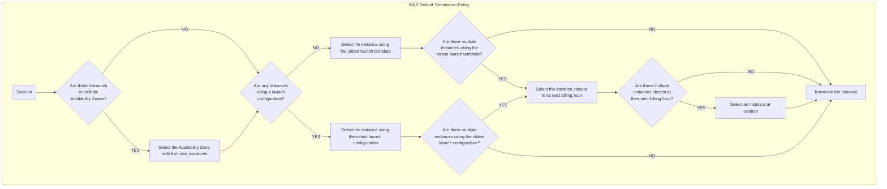
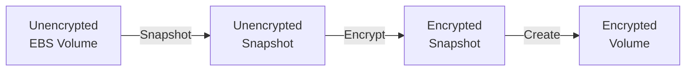
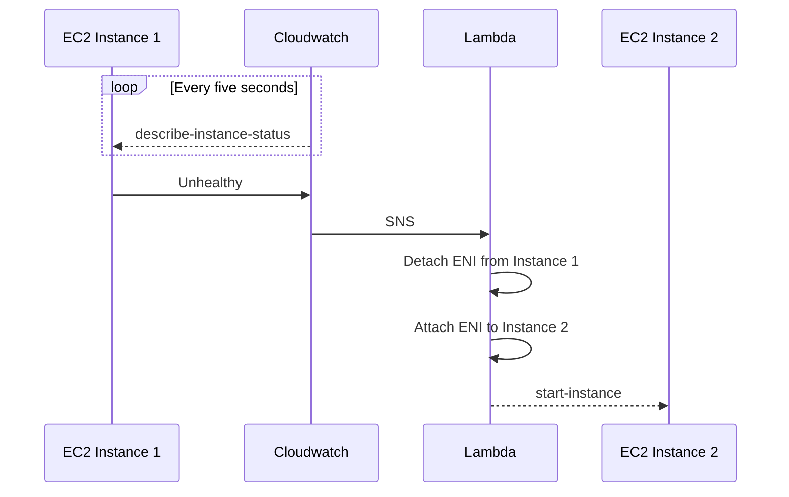
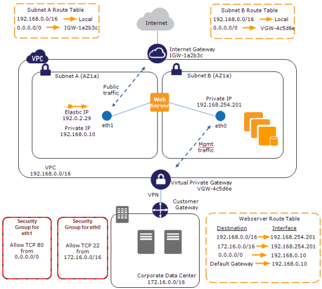
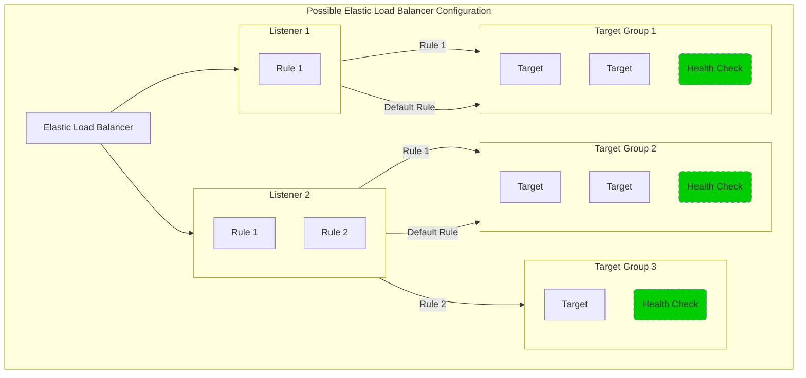

# AWS SAA-C02 Study Guide

This guide is designed to give you a solid understanding of all material covered on the AWS Certified Solutions Architect - Associate exam.
It does assume some prior knowledge of AWS resources, and should be used as a companion guide to one or more of:
1. Stéphane Maarek's [Ultimate AWS Certified Solutions Architect Associate](https://links.datacumulus.com/aws-certified-sa-associate-coupon)
2. A Cloud Guru's [Certified Solutions Architect - Associate](https://acloudguru.com/course/aws-certified-solutions-architect-associate-saa-c02)
3. AWS FAQs and whitepapers
4. Andrew Brown's [AWS Certified Solutions Architect - Associate 2020 (PASS THE EXAM!)](https://www.youtube.com/watch?v=Ia-UEYYR44s)

To test your skills before writing the exam you should try:
1. Tutorials Dojo's [AWS Certified Solutions Architect Associate Practice Exams](https://portal.tutorialsdojo.com/courses/aws-certified-solutions-architect-associate-practice-exams/)
2. Stéphane Maarek's [Practice Exams | AWS Certified Solutions Architect Associate](https://links.datacumulus.com/aws-cert-solution-architect-pt-coupon)

Table of Contents
==
1. <a href="#elastic-compute-cloud-ec2">Elastic Compute Cloud (EC2)</a>
2. <a href="#elastic-block-store-ebs">Elastic Block Store (EBS)</a>
3. <a href="#elastic-network-interfaces-eni">Elastic Network Interfaces (ENI)</a>
4. <a href="#elastic-load-balancing-elb">Elastic Load Balancing (ELB)</a>
    * <a href="#application-load-balancing">Application Load Balancing (ALB)</a>
    * <a href="#network-load-balancing">Network Load Balancing (NLB)</a>
    * <a href="#classic-load-balancing">Classic Load Balancing (CLB)</a>
    * <a href="#gateway-load-balancing">Gateway Load Balancing (GWLB)</a>
5. <a href="#amazon-cognito">Amazon Cognito</a>

Elastic Compute Cloud (EC2)
==
Elastic Compute cloud creates virtual servers in the cloud. 
* Each virtual server is called an _instance_.
* Instances are created from _Amazon Machine Image (AMI)_ which are templates describing the operating system and additional software on the instance.
* AWS provides a number of configurations for CPU, memory, storage, and networking capacity for your instances, known as _instance types_.

## EC2 Instance Pricing
For the SAA-C02 exam, the most important pricing models are on-demand, reserved, and spot.

### On-Demand Instances
* Spin up instances as needed, and pay by the second.
* You have full control over when to launch, stop, hibernate, start, reboot, or terminate the instance.
* You should use on-demand instances for applications with short-term, irregular workloads that cannot be interrupted.

### Reserved Instances
* Commit to a consistent instance configuration, including instance type and region, for a term of 1 or 3 years.
* The payment options for reserved instances are:
    * __All Upfront__: Full payment is made at the start of the term, with no other costs or additional hourly charges incurred for the remainder of the term, regardless of hours used.
    * __Partial Upfront__: A portion of the cost must be paid upfront and the remaining hours in the term are billed at a discounted hourly rate, regardless of whether the Reserved Instance is being used.
    * __No Upfront__: You are billed a discounted hourly rate for every hour within the term, regardless of whether the Reserved Instance is being used. No upfront payment is required.

### Spot Instances
* Request unused EC2 instances, which can reduce your Amazon EC2 costs significantly.
* Spot instances are charged per second at the spot price which is set by Amazon EC2.
* Spot instances are a cost-effective choice if you can be flexible about when your applications run and if your applications can be interrupted.
* If EC2 needs the capacity back, spot instances can be interrupted with two minutes notice.

### Savings Plans
* Commit to a consistent amount of usage per hour, for a term of 1 or 3 year.
* Savings plan prices are up to 66% cheaper than on-demand prices.
* Any usage beyond the amount covered by the savings plan will be billed at the on-demand rate.

### Dedicated Hosts
* Pay for a physical host that is fully dedicated to running your instances.

### Dedicated Instances
* Instances that run in a virtual private cloud (VPC) on hardware that's dedicated to a single customer.

### Capacity Reservations
* Reserve capacity for your EC2 instances in a specific Availability Zone for any duration.

## Instace Lifecycle
An Amazon EC2 instance transitions through different states from the moment you launch it through to its termination.

| Instance State  | Description                                                                                                                                                                             | Instance usage billing                                                   |
| --------------- | --------------------------------------------------------------------------------------------------------------------------------------------------------------------------------------- | ------------------------------------------------------------------------ |
| `pending`       | The instance is preparing to enter the running state. An instance enters the pending state when it launches for the first time, or when it is started after being in the stopped state. | Not billed                                                               |
| `running`       | The instance is running and ready for use.                                                                                                                                              | Billed                                                                   |
| `stopping`      | The instance is preparing to be stopped or stop-hibernated.                                                                                                                             | Not billed if preparing to stop.  Billed if preparing to hibernate. |
| `stopped`       | The instance is shut down and cannot be used. The instance can be started at any time.                                                                                                  | Not billed                                                               |
| `shutting-down` | The instance is preparing to be terminated.                                                                                                                                             | Not billed                                                               |
| `terminated`    | The instance has been permanently deleted and cannot be started.                                                                                                                        | Not billed                                                               |

__Note__: Reserved Instances that applied to terminated instances are billed until the end of their term according to their payment option.

## Placement Groups
When you launch a new EC2 instance, the EC2 service attempts to place the instance in such a way that all of your instances are spread out across underlying hardware to minimize correlated failures.
You can use placement groups to influence the placement of your instances.
You can use the following placement strategies:

### Cluster
* Packs instances close together inside an Availability Zone
* This strategy enables workloads to achieve the low-latency network performance.
* Recommended for applications that benefit from low network latency, high network throughput, or both.
* Also recommended when the majority of the network traffic is between the instances in the group

### Partition
* Spreads your instances across logical partitions such that groups of instances in one partition do not share the underlying hardware with groups of instances in different partitions.
* Each group is divided into logical segments called partitions.
* Each partition within a placement group has its own set of racks.
* Each rack has its own network and power source.
* No two partitions within a placement group share the same racks, allowing you to isolate the impact of hardware failure within your application.
* Partition placement groups are recommended for large distributed and replicated workloads such as Hadoop, Cassandra, and Kafka.

### Spread
* A spread placement group is a group of instances that are each placed on distinct racks, with each rack having its own network and power source.
* A spread placement group can span multiple Availability Zones in the same Region.
* Spread placement groups are recommended for applications that have a small number of critical instances that should be kept physically isolated from each other.

## Security
* Each EC2 instance runs with an associated IAM role.
* You can only attach one IAM role to an instance, but you can attach the same role to many instances.
* All API requests made by the EC2 instance are done using this role.
* You are responsible for the following:
    * Controlling network access to your instances.
    * Managing the credentials used to connect to your instances.
    * Managing the guest operating system and software deployed to the guest operating system, including updates and security patches.
    * Configuring the IAM roles that are attached to the instance and the permissions associated with those roles.

Auto Scaling
==
AWS Auto Scaling lets you build scaling plans that automate how groups of different resources respond to changes in demand. AWS Auto Scaling automatically creates all of the scaling policies and sets targets for you based on your preference. AWS Auto Scaling monitors your application and automatically adds or removes capacity from your resource groups in real-time as demands change.

## EC2 Auto Scaling
EC2 Auto Scaling helps you ensure that you have the correct number of EC2 instances available to handle the load for your application.

EC2 Auto Scaling has three components:
* _Auto Scaling groups_ are logical units used for scaling and management. When you create a group you define the maximum, minimum, and desired number of instances.
* _Configuration templates_ provide the configurations that should be used when launching EC2 instances in the group.
* _Scaling options_ describe the conditions under which EC2 instances will be spun up or down.

### Auto Scaling Groups (ASGs)
An Auto Scaling group contains a collection of EC2 instances which are treated as a logical grouping for the purposes of automatic scaling and management.
* An Auto Scaling group can launch On-Demand Instances, Spot Instances, or both.

#### Using Multiple Instance Types
* When you configure an Auto Scaling group you can specify the instance types, and optionally give a weight to each instance type.
* The weight of each instance type determines how much it will contribute to the capacity of the ASG.
* This is useful if you are not particular with which instance type you use, and care more about the total number of memory/vCPUs in your ASG.
* By default all instances are treated with the same weight.

#### Using Multiple Purchase Options
* When you configure an Auto Scaling group you can also specify how much on-demand and spot capacity to launch.
* You can define the percentage of the group to launch as on-demand instances, as well as the base number of on-demand instances.
* Auto Scaling will first scale up to the base number of on-demand instances.
* The proportion of instances after that will be at the Auto Scaling group's on-demand percentage.
* To better understand base capacity vs scaling percentage look at the table below. In this example, we have an Auto Scaling Group with on-demand base of 12, on-demand percentage of 50%, and spot percentage of 50%.

    | Total Instances Running in ASG | Number of On-Demand from Base | Number of On-Demand from Percentage | Number of Spot from Percentage |
    | :----------------------------- | :---------------------------- | :---------------------------------- | :----------------------------- |
    | 10                             | 10                            | 0                                   | 0                              |
    | 20                             | 12                            | 4                                   | 4                              |
    | 30                             | 12                            | 9                                   | 9                              |
    | 40                             | 12                            | 14                                  | 14                             |
* You can create an ASG from an existing EC2 instance. All instances in this group will use the same attributes such as AMI, instance type, key pair, etc.

### Configuration Templates
EC2 Auto Scaling can be configured with either _launch templates_ or _launch configurations_.
* Launch configurations allow you to specify the AMI, instance type, key pair, security group(s), and a block device mapping of the instances in your ASG.
* Each ASG can have only one launch configuration.
* You can create a launch configuration from an existing EC2 instance.
* Launch templates are similar to launch configurations in that it allows you to specify the parameters of EC2 instances in your ASG.
* The major benefit of using a launch template over a launch configuration is that you can have multiple versions of a launch template.
* Launch templates are the current generation of configuration templates, and should be used in favour of launch configurations.

### Scaling Options
AWS offers a number of ways to scale your groups:
* Maintain current instance levels at all times
    * Auto Scaling performs periodic health checks of the instances in your group.
    * When an instance is unhealthy, Auto Scaling terminates the instance and launches a new one.
* Scale manually
    * You can change the size of an existing ASG manually at any time.
    * You can update the desired capacity of the ASG, or update the instances that are attached to it.
* Scheduled scaling:
    * Scheduled scaling lets you scale when there are predictable load changes (for example, an end-of-week batch process that needs to complete).
    * You can specify a recurring schedule (using cron), start, and end times for your action.
* Dynamic scaling:
    * Dynamic scaling allows you to scale your ASG in response to changing demand.
    * A dynamic scaling policy instructs Amazon EC2 Auto Scaling to track a specific CloudWatch metric.
    * For example, you can add more instances to an ASG when the average CPU usage of all instances is >50%.
    * Dynamic auto-scaling offers three scaling policy types:
        * Target tracking scaling: Increase or decrease the current capacity of the group based on a target value for a specific metric.
        * Increase or decrease the current capacity of the group based on a set of scaling adjustments, known as step adjustments, that vary based on the size of the alarm breach.
        * Simple scaling: Increase or decrease the current capacity of the group based on a single scaling adjustment.
* Predictive scaling:
    * Predictive scaling uses machine learning to predict capacity requirements based on historical data from CloudWatch.
    * Predictive scaling is similar to dynamic scaling in that it scales your ASG based on demand. The key difference is that predictive scaling is proactive, and launches capacity in advance of forecasted load while dynamic scaling is reactive in nature.
    * Predictive scaling is suitable for workloads which are recurring based on the day of the week and/or time of day.
    * Predictive scaling needs at least 24 hours of historical data to start forecasting, but forecasts are more effective if historical data spans two weeks.

## Instance Termination
Auto Scaling uses a _termination policy_ to determine which instance it will terminate first during a scale in event.
* Scale-in events occur in the following scenarios:
    * When using dynamic scaling policies and the size of the group decreases as a result of changes in a metric's value.
    * When using scheduled scaling and the size of the group decreases as a result of a scheduled action.
    * When you manually decrease the size of the group.
* Auto Scaling groups have a default termination policy but you can define a custom policy based on your application needs.
* When terminating instances Auto Scaling uses the following logic:
    1. If there are instances in multiple Availability Zones terminate an instance in the AZ with the most instances.
    2. Terminate the instance using the oldest launch configuration. If no instances are using a launch configuration, terminate the instance using the oldest launch template.
    3. Terminate the instance closest to its next billing hour.
    4. Terminate an instance at random.

Elastic Block Store (EBS)
==
An Amazon EBS volume is a durable, block-level storage device that you can attach to your instances. After you attach a volume to an instance, you can use it as you would use a physical hard drive.

* There are five types of EBS storage:
    * General Purpose SSD (gp2, and gp3)
    * Provisioned IOPS SSD, built for  (io1, io2, and io2 block express)
    * Throughput Optimized HDD (st1)
    * Cold HDD (sc1)
    * Magnetic (standard)
* EBS volumes are automatically replicated within their Availability Zone to prevent data loss in the event of hardware failure.
* You can attach multiple EBS volumes to a single instance.
* `io1` and `io2` volumes can be attached to up to 16 Nitro-based instances.
* All other volume types can be attached to a single instance.
* Volumes and instances must be in the same Availability Zone.
* The table below gives a high-level overview of each volume type.

| Class                          | Type              | Size per I/O | Max IOPS per volume | Max throughput per volume | Multi-attach  | Boot volume   |
| :----------------------------- | ----------------- | ------------ | ------------------- | ------------------------- | ------------- | ------------- |
| General Purpose SSD            | gp3               | 16 KiB       | 16,000              | 1,000 MiB/s               | Not supported | Supported     |
| General Purpose SSD            | gp2               | 16 KiB       | 16,000              | 250 MiB/s                 | Not supported | Supported     |
| Provisioned IOPS SSD           | io2 Block Express | 16 KiB       | 256,000             | 4,000 MiB/s               | Supported     | Supported     |
| Provisioned IOPS SSD           | io2               | 16 KiB       | 64,000†             | 1,000 MiB/s†              | Supported     | Supported     |
| Provisioned IOPS SSD           | io1               | 16 KiB       | 64,000†             | 1,000 MiB/s†              | Supported     | Supported     |
| Throughput Optimized HDD       | st1               | 1 MiB        | 500                 | 500 MiB/s                 | Not supported | Not supported |
| Cold HDD                       | sc1               | 1 MiB        | 250                 | 250 MiB/s                 | Not supported | Not supported |
| Magnetic (Previous Generation) | standard          |              | 40–200              | 40–90 MiB/s               | Not supported | Supported     |

† Maximum IOPS and throughput are guaranteed only on Instances built on the Nitro System provisioned with more than 32,000 IOPS

## Data Persistence
* EBS volumes are off-instance storage which exist independently from the life of an instance.
* When configuring an EBS volume for an EC2 instance you set a `Delete on Termination` parameter:
    * If set to `true`, the volume will delete upon termination of the EC2 instance.
    * If set to `false`, the volume will automatically detach with its data intact upon termination. The volume can then be reattached to a new instance.
    * By default, `Delete on Termination` is set to `true` for the root volume, and `false` for all other volume types.
* You continue to pay for the volume usage as long as the data persists.

## Data Encryption
* Use Amazon EBS encryption as a straight-forward encryption solution for your EBS resources associated with your EC2 instances.
* Amazon EBS encryption uses AWS KMS keys when creating encrypted volumes and snapshots.
* Encryption operations occur on the servers that host EC2 instances.
* You can attach both encrypted and unencrypted volumes to an instance simultaneously.
* All EBS volume types support encryption.
* All current generation EC2 instance types support EBS encryption.
* When you create an encrypted EBS volume and attach it to a supported instance type, the following types of data are encrypted:
    * Data at rest inside the volume
    * All data moving between the volume and the instance
    * All snapshots created from the volume
    * All volumes created from those snapshots
* You cannot directly encrypt existing unencrypted volumes or snapshots.
* You can create encrypted volumes or snapshots from unencrypted volumes or snapshots.
* The diagram below demonstrates how to create an encrypted volume an from an unencrypted volume.

## Snapshots
* Snapshots are point-in-time copies of volumes.
* Snapshots are saved to S3, and are charged based on the amount of data stored.
* When you create a new volume from a snapshot, it's an exact copy of the original volume at the time the snapshot was taken.
* EBS volumes that are created from encrypted snapshots are automatically encrypted.
* When you create snapshots, you incur charges in Amazon S3 based on the volume's total size.
* Snapshots are incremental backups - when you create a new snapshot, only the blocks that have changes since the last snapshot are saved.
* When you create an EBS volume based on a snapshot, the replicated volume loads data in the background so that you can begin using it immediately.
* It is good practice to tag all instances and snapshots.

Elastic Network Interfaces (ENI)
==
An elastic network interface is a networking component that represents a virtual network card.
When you launch an EC2 instance, a default ENI is created and attched to the instance.
However, you can configure more ENIs and attach them to the same instance.
* Each ENI can include:
    * A primary private IPv4 address from the IPv4 address range of your VPC
    * One or more secondary private IPv4 addresses from the IPv4 address range of your VPC
    * One Elastic IP address (IPv4) per private IPv4 address
    * One public IPv4 address
    * One or more IPv6 addresses
    * One or more security groups
    * A MAC address
    * A source/destination check flag
* ENI is used mainly for low-budget, high-availability network solutions.
* You can attach a network interface to an EC2 instance in the following ways:
    * When it's running (hot attach)
    * When it's stopped (warm attach)
    * When the instance is being launched (cold attach).
* You can move a network interface from one instance to another, if the instances are in the same Availability Zone and VPC but in different subnets.
* ENIs can be used as a cheap failover mechanism in the event an instance fails.

* ENIs are also often used as the primary network interfaces for Docker containers launched on ECS using Fargate.
* Some commercial software licenses are tied to a particular MAC address. You can license it against the MAC address of the ENI. Later, if you need to change instances or instance types, you can launch a replacement instance with the same ENI and MAC address.
* ENIs can be used to create a dual-homed environment for your web, application, and database servers. In this example two ENIs are attached to a single EC2 instance which is functioning as a web server:
    * The instance’s first ENI would be attached to a public subnet, routing 0.0.0.0/0 (all traffic) to the VPC’s Internet Gateway.
    * The instance’s second ENI would be attached to a private subnet, with 0.0.0.0 routed to the VPN Gateway connected to your corporate network. You would use the private network for SSH access, management, logging, and so forth.
    * You can apply different security groups to each ENI so that traffic port 80 is allowed through the first ENI, and traffic from the private subnet on port 22 is allowed through the second ENI.

Elastic Load Balancing (ELB)
==
Elastic Load Balancing (ELB) automatically distributes incoming application traffic across multiple targets and virtual appliances. Targets can be in one or more Availability Zones (AZs).
A load balancer serves as the single point of contact for clients.

* Instances behind the ELB are reported as `InService` or `OutOfService`.
* When an EC2 instance behind an ELB fails a health check, the ELB stops sending traffic to that instance.
* If your application stops responding the ELB will respond with a 504 error.
* ELB supports four types of load balancers:
    * Application Load Balancers (ALBs)
    * Network Load Balancers (NLBs)
    * Classic Load Balancers (CLBs)
    * Gateway Load Balancers (GWLBs)
* When setting up an ELB you must define one of more _listeners_.
* Each listener has one or more rules (including a default rule).
* Listeners use rules to forward requests to the appropriate _target group_.
* A target group is used to route requests to one or more registered targets.
* A target can belong to one or more target groups.
* Health checks are defined at the target group level.

## Application Load Balancing
ALBs support load balancing of applications using HTTP and HTTPS (layer 7).
* ALBs allow routing based on
    * Path conditions of the URL (e.g., /img/*)
    * Query string (e.g., version=v1)
    * The IP address of the client (`X-Forwarded-For` request header)
* A target can be one of three types:
    * Instance ID
    * IP Address
    * Lambda function
* By default, an Application Load Balancer routes each request independently to a registered target based on the chosen load-balancing algorithm.
* _Sticky sessions_ enable the load balancer to bind a user's session to a specific target. This is useful for servers that maintain state information.

## Network Load Balancing
NLBs support load balancing of applications on TCP and UDP (layer 4).

* A network load balancer can handle millions of requests per second.
* A target can be one of three types:
    * Instance ID
    * IP Address
    * Application Load Balancer

## Classic Load Balancing
Classic Load Balancers are the first generation of AWS load balancers.
CLBs support balancing on either HTTP/HTTPS, or TCP.
AWS recommends using either ALBs of NLBs in favour of CLBs

## Gateway Load Balancing
GWLBs operate at the network layer (layer 3).

* A target can be one of two types:
    * Instance ID
    * IP Address

Amazon Cognito
==
Amazon Cognito provides authentication, authorization, and user management for your web and mobile apps. Your users can sign in directly with a user name and password, or through a third party such as Facebook, Amazon, Google or Apple. The two main components of Amazon Cognito are user pools and identity pools.

User Pools
---
User pools are user directories that provide sign-up and sign-in options for your app users.
* User pools provide
    * Sign-up, and sign-in services
    * A customizable web UI for signing in users
    * User directory management
    * MFA, phone, and email verification
* After successfully authenticating a user, Amazon Cognito issues JSON web tokens. These tokens can be
    * Used to access resources via APIs, such as API Gateway
    * Exchanged for AWS credentials using identity pools

Identity Pools
---
Identity pools enable you to grant your users access to other AWS services.

A common set-up for granting users access to your AWS resources is:
1. The user signs in through a user pool and receives user pool tokens after a successful authentication.
2. The app exchanges the user pool tokens for AWS credentials through an identity pool.
3. Finally, your app user can then use those AWS credentials to access other AWS services.

    