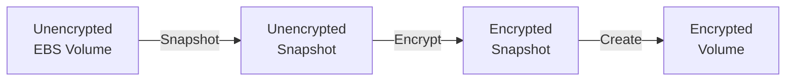

# AWS SAA-C02 Study Guide

Table of Contents
==
1. <a href="#elastic-compute-cloud-ec2">Elastic Compute Cloud (EC2)</a>
2. <a href="#elastic-block-store-ebs">Elastic Block Store (EBS)</a>
3. <a href="#elastic-load-balancers-elb">Elastic Load Balancers (ELB)</a>

Elastic Compute Cloud (EC2)
==
Elastic Compute Cloud is

Elastic Block Store (EBS)
==
An Amazon EBS volume is a durable, block-level storage device that you can attach to your instances. After you attach a volume to an instance, you can use it as you would use a physical hard drive.

* There are five types of EBS storage:
    * General Purpose SSD (gp2, and gp3)
    * Provisioned IOPS SSD, built for  (io1, io2, and io2 block express)
    * Throughput Optimized HDD (st1)
    * Cold HDD (sc1)
    * Magnetic (standard)
* EBS volumes are automatically replicated within their Availability Zone to prevent data loss in the event of hardware failure.
* You can attach multiple EBS volumes to a single instance.
* `io1` and `io2` volumes can be attached to up to 16 Nitro-based instances.
* All other volume types can be attached to a single instance.
* Volumes and instances must be in the same Availability Zone.
* The below table gives a high-level overview of each volume type.

| Class                          | Type              | Size per I/O | Max IOPS per volume | Max throughput per volume | Multi-attach  | Boot volume   |
| :----------------------------- | ----------------- | ------------ | ------------------- | ------------------------- | ------------- | ------------- |
| General Purpose SSD            | gp3               | 16 KiB       | 16,000              | 1,000 MiB/s               | Not supported | Supported     |
| General Purpose SSD            | gp2               | 16 KiB       | 16,000              | 250 MiB/s                 | Not supported | Supported     |
| Provisioned IOPS SSD           | io2 Block Express | 16 KiB       | 256,000             | 4,000 MiB/s               | Supported     | Supported     |
| Provisioned IOPS SSD           | io2               | 16 KiB       | 64,000†             | 1,000 MiB/s†              | Supported     | Supported     |
| Provisioned IOPS SSD           | io1               | 16 KiB       | 64,000†             | 1,000 MiB/s†              | Supported     | Supported     |
| Throughput Optimized HDD       | st1               | 1 MiB        | 500                 | 500 MiB/s                 | Not supported | Not supported |
| Cold HDD                       | sc1               | 1 MiB        | 250                 | 250 MiB/s                 | Not supported | Not supported |
| Magnetic (Previous Generation) | standard          |              | 40–200              | 40–90 MiB/s               | Not supported | Supported     |

† Maximum IOPS and throughput are guaranteed only on Instances built on the Nitro System provisioned with more than 32,000 IOPS

## Data Persistence
* EBS volumes are off-instance storage which exist independently from the life of an instance.
* When configuring an EBS volume for an EC2 instance you set a `Delete on Termination` parameter:
    * If set to `true`, the volume will delete upon termination of the EC2 instance.
    * If set to `false`, the volume will automatically detach with its data intact upon termination. The volume can then be reattached to a new instance.
    * By default, `Delete on Termination` is set to `true` for the root volume, and `false` for all other volume types.
* You continue to pay for the volume usage as long as the data persists.

## Data Encryption
* Use Amazon EBS encryption as a straight-forward encryption solution for your EBS resources associated with your EC2 instances.
* Amazon EBS encryption uses AWS KMS keys when creating encrypted volumes and snapshots.
* Encryption operations occur on the servers that host EC2 instances.
* You can attach both encrypted and unencrypted volumes to an instance simultaneously.
* All EBS volume types support encryption.
* All current generation EC2 instance types support EBS encryption.
* When you create an encrypted EBS volume and attach it to a supported instance type, the following types of data are encrypted:
    * Data at rest inside the volume
    * All data moving between the volume and the instance
    * All snapshots created from the volume
    * All volumes created from those snapshots
* You cannot directly encrypt existing unencrypted volumes or snapshots.
* You can create encrypted volumes or snapshots from unencrypted volumes or snapshots.
* The diagram below demonstrates how to effectively encrypt an unencrypted EBS volume.

## Snapshots
* Snapshots are point-in-time copies of volumes.
* Snapshots are saved to S3, and are charged based on the amount of data stored.
* When you create a new volume from a snapshot, it's an exact copy of the original volume at the time the snapshot was taken.
* EBS volumes that are created from encrypted snapshots are automatically encrypted.
* When you create snapshots, you incur charges in Amazon S3 based on the volume's total size.
* Snapshots are incremental backups - when you create a new snapshot, only the blocks that have changes since the last snapshot are saved.
* When you create an EBS volume based on a snapshot, the replicated volume loads data in the background so that you can begin using it immediately.
* It is good practice to tag all instances and snapshots.

Elastic Load Balancers (ELB)
==
Elastic Load Balancing (ELB) automatically distributes incoming application traffic across multiple targets and virtual appliances. Targets can be in one or more Availability Zones (AZs).

Amazon Cognito
==
The two main components of Amazon Cognito are user pools and identity pools.

User Pools
---

Identity Pools
---

