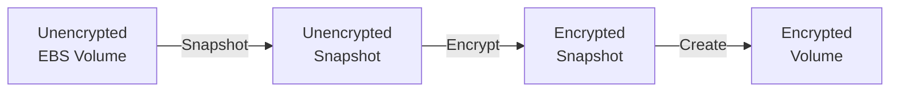
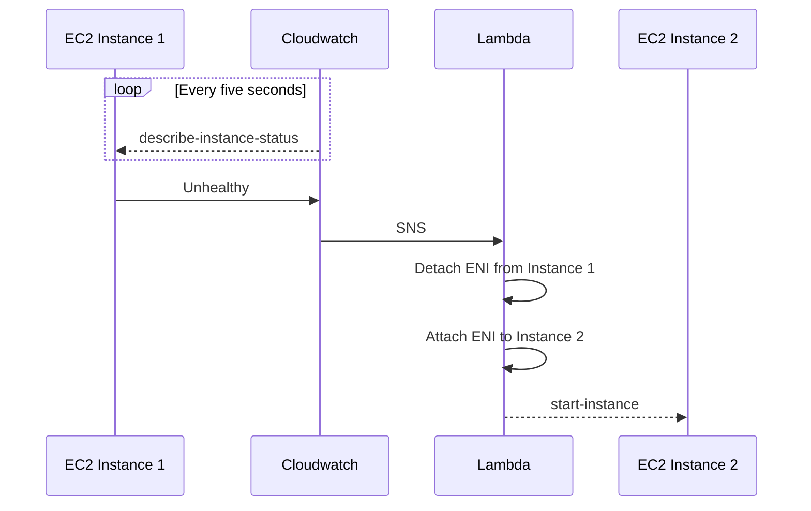
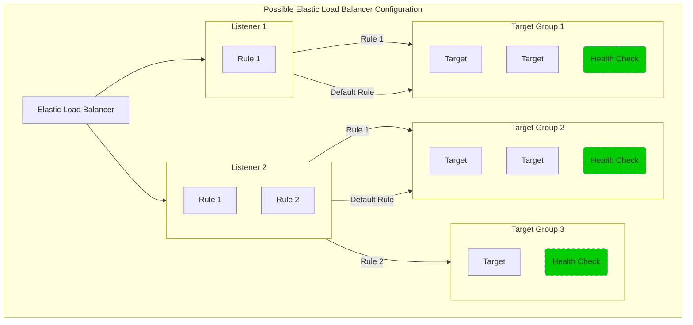

# AWS SAA-C02 Study Guide

Table of Contents
==
1. <a href="#elastic-compute-cloud-ec2">Elastic Compute Cloud (EC2)</a>
2. <a href="#elastic-block-store-ebs">Elastic Block Store (EBS)</a>
3. <a href="#elastic-network-interfaces-eni">Elastic Network Interfaces (ENI)</a>
4. <a href="#elastic-load-balancing-elb">Elastic Load Balancing (ELB)</a>
    * <a href="#application-load-balancing">Application Load Balancing (ALB)</a>
    * <a href="#network-load-balancing">Network Load Balancing (NLB)</a>
    * <a href="#classic-load-balancing">Classic Load Balancing (CLB)</a>
    * <a href="#gateway-load-balancing">Gateway Load Balancing (GWLB)</a>

Elastic Compute Cloud (EC2)
==
Elastic Compute Cloud is

Elastic Block Store (EBS)
==
An Amazon EBS volume is a durable, block-level storage device that you can attach to your instances. After you attach a volume to an instance, you can use it as you would use a physical hard drive.

* There are five types of EBS storage:
    * General Purpose SSD (gp2, and gp3)
    * Provisioned IOPS SSD, built for  (io1, io2, and io2 block express)
    * Throughput Optimized HDD (st1)
    * Cold HDD (sc1)
    * Magnetic (standard)
* EBS volumes are automatically replicated within their Availability Zone to prevent data loss in the event of hardware failure.
* You can attach multiple EBS volumes to a single instance.
* `io1` and `io2` volumes can be attached to up to 16 Nitro-based instances.
* All other volume types can be attached to a single instance.
* Volumes and instances must be in the same Availability Zone.
* The table below gives a high-level overview of each volume type.

| Class                          | Type              | Size per I/O | Max IOPS per volume | Max throughput per volume | Multi-attach  | Boot volume   |
| :----------------------------- | ----------------- | ------------ | ------------------- | ------------------------- | ------------- | ------------- |
| General Purpose SSD            | gp3               | 16 KiB       | 16,000              | 1,000 MiB/s               | Not supported | Supported     |
| General Purpose SSD            | gp2               | 16 KiB       | 16,000              | 250 MiB/s                 | Not supported | Supported     |
| Provisioned IOPS SSD           | io2 Block Express | 16 KiB       | 256,000             | 4,000 MiB/s               | Supported     | Supported     |
| Provisioned IOPS SSD           | io2               | 16 KiB       | 64,000†             | 1,000 MiB/s†              | Supported     | Supported     |
| Provisioned IOPS SSD           | io1               | 16 KiB       | 64,000†             | 1,000 MiB/s†              | Supported     | Supported     |
| Throughput Optimized HDD       | st1               | 1 MiB        | 500                 | 500 MiB/s                 | Not supported | Not supported |
| Cold HDD                       | sc1               | 1 MiB        | 250                 | 250 MiB/s                 | Not supported | Not supported |
| Magnetic (Previous Generation) | standard          |              | 40–200              | 40–90 MiB/s               | Not supported | Supported     |

† Maximum IOPS and throughput are guaranteed only on Instances built on the Nitro System provisioned with more than 32,000 IOPS

## Data Persistence
* EBS volumes are off-instance storage which exist independently from the life of an instance.
* When configuring an EBS volume for an EC2 instance you set a `Delete on Termination` parameter:
    * If set to `true`, the volume will delete upon termination of the EC2 instance.
    * If set to `false`, the volume will automatically detach with its data intact upon termination. The volume can then be reattached to a new instance.
    * By default, `Delete on Termination` is set to `true` for the root volume, and `false` for all other volume types.
* You continue to pay for the volume usage as long as the data persists.

## Data Encryption
* Use Amazon EBS encryption as a straight-forward encryption solution for your EBS resources associated with your EC2 instances.
* Amazon EBS encryption uses AWS KMS keys when creating encrypted volumes and snapshots.
* Encryption operations occur on the servers that host EC2 instances.
* You can attach both encrypted and unencrypted volumes to an instance simultaneously.
* All EBS volume types support encryption.
* All current generation EC2 instance types support EBS encryption.
* When you create an encrypted EBS volume and attach it to a supported instance type, the following types of data are encrypted:
    * Data at rest inside the volume
    * All data moving between the volume and the instance
    * All snapshots created from the volume
    * All volumes created from those snapshots
* You cannot directly encrypt existing unencrypted volumes or snapshots.
* You can create encrypted volumes or snapshots from unencrypted volumes or snapshots.
* The diagram below demonstrates how to create an encrypted volume an from an unencrypted volume.

## Snapshots
* Snapshots are point-in-time copies of volumes.
* Snapshots are saved to S3, and are charged based on the amount of data stored.
* When you create a new volume from a snapshot, it's an exact copy of the original volume at the time the snapshot was taken.
* EBS volumes that are created from encrypted snapshots are automatically encrypted.
* When you create snapshots, you incur charges in Amazon S3 based on the volume's total size.
* Snapshots are incremental backups - when you create a new snapshot, only the blocks that have changes since the last snapshot are saved.
* When you create an EBS volume based on a snapshot, the replicated volume loads data in the background so that you can begin using it immediately.
* It is good practice to tag all instances and snapshots.

Elastic Network Interfaces (ENI)
==
An elastic network interface is a networking component that represents a virtual network card.
When you launch an EC2 instance, a default ENI is created and attched to the instance.
However, you can configure more ENIs and attach them to the same instance.
* Each ENI can include:
    * A primary private IPv4 address from the IPv4 address range of your VPC
    * One or more secondary private IPv4 addresses from the IPv4 address range of your VPC
    * One Elastic IP address (IPv4) per private IPv4 address
    * One public IPv4 address
    * One or more IPv6 addresses
    * One or more security groups
    * A MAC address
    * A source/destination check flag
* ENI is used mainly for low-budget, high-availability network solutions.
* You can attach a network interface to an EC2 instance in the following ways:
    * When it's running (hot attach)
    * When it's stopped (warm attach)
    * When the instance is being launched (cold attach).
* You can move a network interface from one instance to another, if the instances are in the same Availability Zone and VPC but in different subnets.
* ENIs can be used as a cheap failover mechanism in the event an instance fails.

* While the above pattern is valid, EC2 auto-scaling is the preferred approach.
* ENIs are also often used as the primary network interfaces for Docker containers launched on ECS using Fargate.
* Some commercial software licenses are tied to a particular MAC address. You can license it against the MAC address of the ENI. Later, if you need to change instances or instance types, you can launch a replacement instance with the same ENI and MAC address.
* ENIs can be used to create a dual-homed environment for your web, application, and database servers. In this example two ENIs are attached to a single EC2 instance which is functioning as a web server:
    * The instance’s first ENI would be attached to a public subnet, routing 0.0.0.0/0 (all traffic) to the VPC’s Internet Gateway.
    * The instance’s second ENI would be attached to a private subnet, with 0.0.0.0 routed to the VPN Gateway connected to your corporate network. You would use the private network for SSH access, management, logging, and so forth.
    * You can apply different security groups to each ENI so that traffic port 80 is allowed through the first ENI, and traffic from the private subnet on port 22 is allowed through the second ENI.

Elastic Load Balancing (ELB)
==
Elastic Load Balancing (ELB) automatically distributes incoming application traffic across multiple targets and virtual appliances. Targets can be in one or more Availability Zones (AZs).
A load balancer serves as the single point of contact for clients.

* Instances behind the ELB are reported as `InService` or `OutOfService`.
* When an EC2 instance behind an ELB fails a health check, the ELB stops sending traffic to that instance.
* If your application stops responding the ELB will respond with a 504 error.
* ELB supports four types of load balancers:
    * Application Load Balancers (ALBs)
    * Network Load Balancers (NLBs)
    * Classic Load Balancers (CLBs)
    * Gateway Load Balancers (GWLBs)
* When setting up an ELB you must define one of more _listeners_.
* Each listener has one or more rules (including a default rule).
* Listeners use rules to forward requests to the appropriate _target group_.
* A target group is used to route requests to one or more registered targets.
* A target can belong to one or more target groups.
* Health checks are defined at the target group level.

## Application Load Balancing
ALBs support load balancing of applications using HTTP and HTTPS (layer 7).
* ALBs allow routing based on
    * Path conditions of the URL (e.g., /img/*)
    * Query string (e.g., version=v1)
    * The IP address of the client (`X-Forwarded-For` request header)
* A target can be one of three types:
    * Instance ID
    * IP Address
    * Lambda function
* By default, an Application Load Balancer routes each request independently to a registered target based on the chosen load-balancing algorithm.
* _Sticky sessions_ enable the load balancer to bind a user's session to a specific target. This is useful for servers that maintain state information.

## Network Load Balancing
NLBs support load balancing of applications on TCP and UDP (layer 4).

* A network load balancer can handle millions of requests per second.
* A target can be one of three types:
    * Instance ID
    * IP Address
    * Application Load Balancer

## Classic Load Balancing
Classic Load Balancers are the first generation of AWS load balancers.
CLBs support balancing on either HTTP/HTTPS, or TCP.
AWS recommends using either ALBs of NLBs in favour of CLBs

## Gateway Load Balancing
GWLBs operate at the network layer (layer 3).

* A target can be one of two types:
    * Instance ID
    * IP Address

Amazon Cognito
==
The two main components of Amazon Cognito are user pools and identity pools.

User Pools
---

Identity Pools
---

