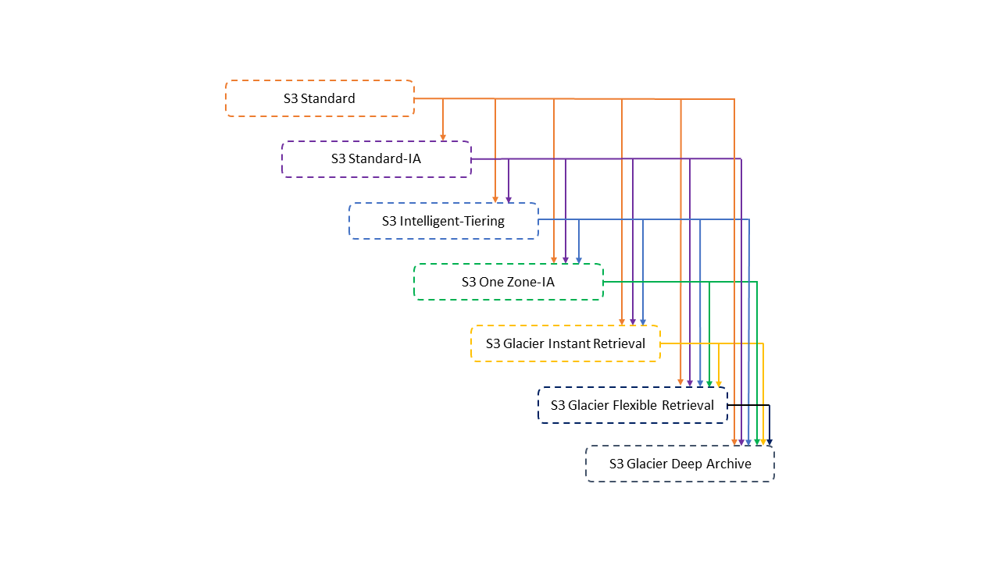

# AWS SAA-C02 Study Guide
This guide is designed to give you a solid understanding of all material covered on the AWS Certified Solutions Architect - Associate exam.
It does assume some prior knowledge of AWS resources, and should be used as a companion guide to one or more of:
1. Stéphane Maarek's [Ultimate AWS Certified Solutions Architect Associate](https://links.datacumulus.com/aws-certified-sa-associate-coupon)
2. A Cloud Guru's [Certified Solutions Architect - Associate](https://acloudguru.com/course/aws-certified-solutions-architect-associate-saa-c02)
3. AWS FAQs and whitepapers
4. Andrew Brown's [AWS Certified Solutions Architect - Associate 2020 (PASS THE EXAM!)](https://www.youtube.com/watch?v=Ia-UEYYR44s)

To test your skills before writing the exam you should try:
1. Tutorials Dojo's [AWS Certified Solutions Architect Associate Practice Exams](https://portal.tutorialsdojo.com/courses/aws-certified-solutions-architect-associate-practice-exams/)
2. Stéphane Maarek's [Practice Exams | AWS Certified Solutions Architect Associate](https://links.datacumulus.com/aws-cert-solution-architect-pt-coupon)

Table of Contents
==
1. <a href="#identity-access-management-iam">Identity Access Management (IAM)</a>
2. <a href="#simple-storage-service-s3">Simple Storage Service (S3)</a>
3. <a href="#cloudfront">Cloudfront</a>
3. <a href="#global-accelerator">Global Accelerator</a>
4. <a href="#snow-family">Snow Family</a>
5. <a href="#storage-gateway">Storage Gateway</a>
6. <a href="#elastic-compute-cloud-ec2">Elastic Compute Cloud (EC2)</a>
7. <a href="#elastic-fabric-adapter">Elastic Fabric Adapter</a>
8. <a href="#elastic-block-store-ebs">Elastic Block Store (EBS)</a>
10. <a href="#elastic-file-system-efs">Elastic File System (EFS)</a>
9. <a href="#elastic-network-interfaces-eni">Elastic Network Interfaces (ENI)</a>
10. <a href="#elastic-load-balancing-elb">Elastic Load Balancing (ELB)</a>
    * <a href="#application-load-balancing">Application Load Balancing (ALB)</a>
    * <a href="#network-load-balancing">Network Load Balancing (NLB)</a>
    * <a href="#classic-load-balancing">Classic Load Balancing (CLB)</a>
    * <a href="#gateway-load-balancing">Gateway Load Balancing (GWLB)</a>
11. <a href="#amazon-virtual-private-cloud-vpc">Amazon Virtual Private Cloud (VPC)</a>
12. <a href="#aws-direct-connect">AWS Direct Connect</a>
13. <a href="#route-53">Route 53</a>
14. <a href="#simple-queue-service-sqs">Simple Queue Service (SQS)</a>
15. <a href="#simple-workflow-service-swf">Simple Workflow Service (SWF)</a>
16. <a href="#simple-notification-service-sns">Simple Notification Service (SNS)</a>
17. <a href="#aws-batch">AWS Batch</a>
18. <a href="#amazon-cognito">Amazon Cognito</a>

Identity Access Management (IAM)
==

Simple Storage Service (S3)
==
Amazon Simple Storage Service (Amazon S3) is an object storage service.
* An object is any file, and any metadata that describes the file.
* A bucket is the container for objects.
* Each object in a bucket has a unique identifier called a key.

### Storage Classes
S3 offers different storage classes for objects depending on your use case scenario and performance access requirements.
* S3 Standard is the default storage class. This class is best for performance-sensitive use cases which require millisecond access time.
* S3 Intelligent-Tiering is designed to optimize storage costs by automatically moving data to the most cost-effective access tier. S3 Intelligent-Tiering automatically stores objects in three access tiers: a Frequent Access, Infrequent Access, and Archive Instant Access. Objects that are uploaded or transitioned to S3 Intelligent-Tiering are automatically stored in the Frequent Access tier. Objects that have not been accessed in 30 consecutive days are automatically moved to the Infrequent Access tier. Objects that have not been accessed for 90 consecutive days will automatically move to the Archive Instant Access tier.

* S3 Standard-IA designed for long-lived and infrequently accessed data. Objects are available for millisecond access, but Amazon S3 charges a retrieval fee for these objects. With Standard-IA, objects are stored redundantly across multiple availability zones.
* S3 One Zone-IA is similar to Standard-IA, except objects are stored in only one availability zone. One Zone-IA is a good choice if data can be recreated in the event an availability zone goes down.
* S3 Glacier Instant Retrieval is used for archiving data that is rarely accessed and requires milliseconds retrieval. This storage class offers a lower storage cost than Standard-IA, but has a higher data access cost.
* S3 Glacier Flexible Retrieval is used for archives where data might need to be retrieved in minutes.
* S3 Glacier Deep Archive is the cheapest storage class in S3. It has a default retrieval time of 12 hours.

| Storage class                 | Designed for                                                                          | Durability (designed for) | Availability (designed for)        | Availability Zones | Min storage duration | Min billable object size | Other considerations                                                                             |
| ----------------------------- | ------------------------------------------------------------------------------------- | ------------------------- | ---------------------------------- | ------------------ | -------------------- | ------------------------ | ------------------------------------------------------------------------------------------------ |
| S3 Standard                   | Frequently accessed data (more than once a month) with millisecond access             | 99.999999999%             | 99.99%                             | >= 3               | None                 | None                     | None                                                                                             |
| S3 Standard-IA                | Long-lived, infrequently accessed data (once a month) with millisecond access         | 99.999999999%             | 99.9%                              | >= 3               | 30 days              | 128 KB                   | Per GB retrieval fees apply.                                                                     |
| S3 Intelligent-Tiering        | Data with unknown, changing, or unpredictable access patterns                         | 99.999999999%             | 99.9%                              | >= 3               | None                 | None                     | Monitoring and automation fees per object apply. No retrieval fees.                              |
| S3 One Zone-IA                | Recreatable, infrequently accessed data (once a month) with millisecond access        | 99.999999999%             | 99.5%                              | 1                  | 30 days              | 128 KB                   | Per GB retrieval fees apply. Not resilient to the loss of the Availability Zone.                 |
| S3 Glacier Instant Retrieval  | Long-lived, archive data accessed once a quarter with millisecond access              | 99.999999999%             | 99.9%                              | >= 3               | 90 days              | 128 KB                   | Per GB retrieval fees apply.                                                                     |
| S3 Glacier Flexible Retrieval | Long-lived archive data accessed once a year with retrieval times of minutes to hours | 99.999999999%             | 99.99% (after you restore objects) | >= 3               | 90 days              | 40 KB                    | Per GB retrieval fees apply. You must first restore archived objects before you can access them. |
| S3 Glacier Deep Archive       | Long-lived archive data accessed less than once a year with retrieval times of hours  | 99.999999999%             | 99.99% (after you restore objects) | >= 3               | 180 days             | 40 KB                    | Per GB retrieval fees apply. You must first restore archived objects before you can access them. |

### Lifecycle
You can add rules in an S3 Lifecycle configuration to tell Amazon S3 to transition objects to another Amazon S3 storage class.

The chart below shows the supported transitions.

Lifecycle rules can be combined to manage the entire life of an object. For example, you can create a lifecycle rule which transitions objects to Standard-IA after 30 days, another which transitions them to Glacier Flexible Retrieval after 90 days, and a third which deletes the objects after five years.

You should be aware of the following constraints when creating lifecycle configurations:
1. For transitions from S3 Standard to S3 Standard-IA, S3 Intelligent-Tiering, S3 One Zone-IA, or S3 Glacier Instant Retrieval, objects smaller than 128KB will not be transitioned.
2. For transitions from S3 Standard-IA to S3 Intelligent-Tiering, or S3 Glacier Instant Retrieval, objects smaller than 128KB will not be transitioned.
3. Before you transition objects from the S3 Standard to S3 Standard-IA or S3 One Zone-IA, you must store them at least 30 days in the S3 Standard storage class.
4. S3 Standard-IA and S3 One Zone-IA have a minimum 30-day storage charge.

### Transfer Acceleration
S3 Transfer Acceleration is a bucket-level feature that increases file transfer speed between your clients and S3 buckets. 

* Transfer acceleration works by sending your traffic to the globally distributed edge locations in Amazon CloudFront. The data is sent from the edge location to S3 over an optimized path on the private AWS network.
* Once you enable Transfer Acceleration on a bucket, you can use it by targeting the endpoint `<bucketname>.s3-accelerate.amazonaws.com`
* Transfer Acceleration works best on large files. If you are transferring files smaller than ~1GB you might want to use Cloudfront instead of Transfer Acceleration. 

Cloudfront
==
Amazon CloudFront is a web service that speeds up distribution of your static and dynamic web content, such as .html, .css, .js, and image files, to your users. CloudFront delivers your content through a worldwide network of data centers called edge locations. When a user requests content that you're serving with CloudFront, the request is routed to the edge location that provides the lowest latency, so that content is delivered with the best possible performance.

CloudFront points of presence (POPs, also know as edge locations) are deployed globally, close to your users to speed up serving content. CloudFront also offers regional edge caches which sit between POPs, and your origin server. Regional edge caches have larger caches than POPs, and are used to cache less frequently accessed objects.

A few things to note about POPs, and regional edge caches:
* Regional edge caches have feature parity with POPs.
* Proxy HTTP methods (PUT, POST, PATCH, OPTIONS, and DELETE) go directly to the origin from the POPs and do not proxy through the regional edge caches.
* Dynamic requests, as determined at request time, do not flow through regional edge caches, but go directly to the origin.
* When the origin is an Amazon S3 bucket and the request’s optimal regional edge cache is in the same AWS Region as the S3 bucket, the POP skips the regional edge cache and goes directly to the S3 bucket.

CloudFront delivers content to users by first the checking CloudFront POP with the lowest latency. If the object exists in the CloudFront cache, CloudFront returns it to the user. If it does not, CloudFront forwards the request to the origin server (S3 bucket, HTTP server, etc.), the origin server returns it to the CloudFront edge location, and CloudFront returns it to the user. CloudFront then adds the the object to its cache.

### Replacing, and Removing Content
All content cached in CloudFront has a TTL (time-to-live). CloudFront will serve a file from its cache until the cache duration expires. The first time a user requests the file after expiration, CloudFront will request the file from the origin server.

By default, files expire after 24 hours, but this can be changed with the `Minimum TTL`, `Maximum TTL`, and `Default TTL` CloudFront parameters.

If you delete, or modify an object in your origin server, CloudFront will still serve the cached version until the objects TTL expires. If you need to remove a file from CloudFront edge caches before it expires, you can invalidate the file from edge caches. When you invalidate a file, CloudFront returns to the origin to fetch the latest version of the file the next time it is requested by a user.

Global Accelerator
==
AWS Global Accelerator helps improve application performace by creating a more direct path from your clients to your AWS services. It does this by routing your traffic to the optimal regional endpoint. Traffic is then sent to AWS over the AWS global network.

Global Accelerator includes the following components:
* **Static IP addresses**: Global Accelerator provides you with a set of two static IP addresses. The IP addresses serve as single fixed entry points for your clients. IP addresses remain assigned to you accelerator until it is _deleted_.
* **Accelerator**: An accelerator directs traffic to endpoints over the AWS global network. Global Accelerator offers two types of accelerators: standard, and custom.
* **DNS name**: Global Accelerator assigns each accelerator a default DNS name that points to the static IP addresses associated with your accelerator.
* **Network zone**: A network zone services the static IP addresses for your accelerator from a unique IP subnet. Network zones are similar to availability zones in that if a network zone becomes unavailable, clients can retry on the healthy IP in the other network zone.
* **Listener**: A listener processes inbound connections from clients to Global Accelerator for TCP, UDP, or both TCP and UDP protocols. Each listener has one or more endpoint groups associated with it, and traffic is forwarded to endpoints in one of the groups.
* **Endpoint group**: Endpoint groups accept traffic from listeners. Each endpoint group is associated with a specific AWS Region.
* **Endpoint**: An endpoint is the resource that Global Accelerator directs traffic to. Each endpoint is associated with an endpoint group.

## Standard Accelerators
Standard accelerators endpoints can be Network Load Balancers, Application Load Balancers, EC2 instances, or Elastic IP addresses.

When using a standard accelerator, Global Accelerator continuously monitors the health of all endpoints and instantly begins directing traffic to another available endpoint when it determines that an active endpoint is unhealthy.

Standard accelerators direct traffic to endpoint groups based on the location of the clients, and the health of the endpoint group. You can set a custom amount of traffic to send to different endpoint groups by using the traffic dial to increase (dial up) or decrease (dial down) the traffic send to each endpoint group. This is useful for cases such as blue/green testing.

## Custom Accelerators
Custom accelerators direct user traffic based on custom business logic. Endpoints for custom routing accelerators must be virtual private cloud (VPC) subnets, and a custom routing accelerator can only route traffic to Amazon EC2 instances in those subnets.

Custom accelerators are useful in cases such as gaming, where you want traffic for a group of users to all be routed to the same EC2 server regardless of geolocation.

Snow Family
==
The AWS Snow Family offers a number of physical devices, with varying storage, and built-in compute capacity. They are used to transport large amounts of data into, and out of AWS.

## Snowcone
Snowcone is the smallest member of the Snow Family. Snowcone is available in two flavours:
* **Snowcone** has two vCPUs, 4 GB of memory, and 8 TB of hard disk drive (HDD) based storage.
* **Snowcone SSD** has two vCPUs, 4 GB of memory, and 14 TB of solid state drive (SSD) based storage.

## Snowball Edge
Snowball Edge provides huge amounts of storage (80TB of usable HDD), and compute power. It comes in two device options: storage optimized and computed optimized.

The following table demonstrates the different use cases for Snowcone, and Snowball.
| Use case                                          | Snowball Edge | Snowcone |
| ------------------------------------------------- | ------------- | -------- |
| Import data into Amazon S3                        | ✓             | ✓        |
| Export from Amazon S3                             | ✓             |          |
| Durable local storage                             | ✓             |          |
| Local compute with AWS Lambda                     | ✓             |          |
| Local compute instances                           | ✓             | ✓        |
| Durable Amazon S3 storage in a cluster of devices | ✓             |          |
| Use with AWS IoT Greengrass (IoT)                 | ✓             |          |
| Transfer files through NFS with a GUI             | ✓             | ✓        |
| GPU workloads                                     | ✓             |          |

## Snowmobile
AWS Snowmobile moves up to 100 PB of data in a 45-foot long ruggedized shipping container and is ideal for multi-petabyte or Exabyte-scale digital media migrations and data center shutdowns.

Storage Gateway
==
AWS Storage Gateway is a set of hybrid cloud storage services that provide on-premises access to virtually unlimited cloud storage.

Storage gateway provides four different types of gateways:
* Tape Gateway acts as a virtual tape library.
* Amazon S3 File Gateway presents a file interface that enables you to store files as objects in Amazon S3. You can access these files from your data center or Amazon EC2, or as objects directly in Amazon S3.
* Amazon FSx File Gateway stores file-based application data. Customers can store and access file data in Amazon FSx.
* Volume Gateway stores point-in-time snapshots of your volumes as Amazon EBS snapshots. These can be either cached or stored volumes.

## Cached vs Stored Volumes
The main difference between cached and stored volumes is where your primary data is stored. With cached volumes, Amazon S3 is your primary data storage, while retaining frequently accessed data locally in your storage gateway. By using stored volumes, you can store your primary data locally, while asynchronously backing up that data to Amazon S3 as EBS snapshots.

Cached volumes minimize the need to scale your on-premises storage infrastructure, while still providing your applications with low-latency access to their frequently accessed data.

 Stored volumes provide your on-premises applications with low-latency access to their entire datasets. At the same time, they provide durable, offsite backups.

Elastic Compute Cloud (EC2)
==
Elastic Compute cloud creates virtual servers in the cloud. 
* Each virtual server is called an _instance_.
* Instances are created from _Amazon Machine Image (AMI)_ which are templates describing the operating system and additional software on the instance.
* AWS provides a number of configurations for CPU, memory, storage, and networking capacity for your instances, known as _instance types_.

## EC2 Instance Pricing
For the SAA-C02 exam, the most important pricing models are on-demand, reserved, and spot.

### On-Demand Instances
* Spin up instances as needed, and pay by the second.
* You have full control over when to launch, stop, hibernate, start, reboot, or terminate the instance.
* You should use on-demand instances for applications with short-term, irregular workloads that cannot be interrupted.

### Reserved Instances
* Commit to a consistent instance configuration, including instance type and region, for a term of 1 or 3 years.
* The payment options for reserved instances are:
    * __All Upfront__: Full payment is made at the start of the term, with no other costs or additional hourly charges incurred for the remainder of the term, regardless of hours used.
    * __Partial Upfront__: A portion of the cost must be paid upfront and the remaining hours in the term are billed at a discounted hourly rate, regardless of whether the Reserved Instance is being used.
    * __No Upfront__: You are billed a discounted hourly rate for every hour within the term, regardless of whether the Reserved Instance is being used. No upfront payment is required.

### Spot Instances
* Request unused EC2 instances, which can reduce your Amazon EC2 costs significantly.
* Spot instances are charged per second at the spot price which is set by Amazon EC2.
* Spot instances are a cost-effective choice if you can be flexible about when your applications run and if your applications can be interrupted.
* If EC2 needs the capacity back, spot instances can be interrupted with two minutes notice.

### Savings Plans
* Commit to a consistent amount of usage per hour, for a term of 1 or 3 year.
* Savings plan prices are up to 66% cheaper than on-demand prices.
* Any usage beyond the amount covered by the savings plan will be billed at the on-demand rate.

### Dedicated Hosts
* Pay for a physical host that is fully dedicated to running your instances.

### Dedicated Instances
* Instances that run in a virtual private cloud (VPC) on hardware that's dedicated to a single customer.

### Capacity Reservations
* Reserve capacity for your EC2 instances in a specific Availability Zone for any duration.

## Instace Lifecycle
An Amazon EC2 instance transitions through different states from the moment you launch it through to its termination.

| Instance State  | Description                                                                                                                                                                             | Instance usage billing                                                   |
| --------------- | --------------------------------------------------------------------------------------------------------------------------------------------------------------------------------------- | ------------------------------------------------------------------------ |
| `pending`       | The instance is preparing to enter the running state. An instance enters the pending state when it launches for the first time, or when it is started after being in the stopped state. | Not billed                                                               |
| `running`       | The instance is running and ready for use.                                                                                                                                              | Billed                                                                   |
| `stopping`      | The instance is preparing to be stopped or stop-hibernated.                                                                                                                             | Not billed if preparing to stop.  Billed if preparing to hibernate. |
| `stopped`       | The instance is shut down and cannot be used. The instance can be started at any time.                                                                                                  | Not billed                                                               |
| `shutting-down` | The instance is preparing to be terminated.                                                                                                                                             | Not billed                                                               |
| `terminated`    | The instance has been permanently deleted and cannot be started.                                                                                                                        | Not billed                                                               |

__Note__: Reserved Instances that applied to terminated instances are billed until the end of their term according to their payment option.

## Placement Groups
When you launch a new EC2 instance, the EC2 service attempts to place the instance in such a way that all of your instances are spread out across underlying hardware to minimize correlated failures.
You can use placement groups to influence the placement of your instances.
You can use the following placement strategies:

### Cluster
* Packs instances close together inside an Availability Zone
* This strategy enables workloads to achieve the low-latency network performance.
* Recommended for applications that benefit from low network latency, high network throughput, or both.
* Also recommended when the majority of the network traffic is between the instances in the group

### Partition
* Spreads your instances across logical partitions such that groups of instances in one partition do not share the underlying hardware with groups of instances in different partitions.
* Each group is divided into logical segments called partitions.
* Each partition within a placement group has its own set of racks.
* Each rack has its own network and power source.
* No two partitions within a placement group share the same racks, allowing you to isolate the impact of hardware failure within your application.
* Partition placement groups are recommended for large distributed and replicated workloads such as Hadoop, Cassandra, and Kafka.

### Spread
* A spread placement group is a group of instances that are each placed on distinct racks, with each rack having its own network and power source.
* A spread placement group can span multiple Availability Zones in the same Region.
* Spread placement groups are recommended for applications that have a small number of critical instances that should be kept physically isolated from each other.

## Security
* Each EC2 instance runs with an associated IAM role.
* You can only attach one IAM role to an instance, but you can attach the same role to many instances.
* All API requests made by the EC2 instance are done using this role.
* You are responsible for the following:
    * Controlling network access to your instances.
    * Managing the credentials used to connect to your instances.
    * Managing the guest operating system and software deployed to the guest operating system, including updates and security patches.
    * Configuring the IAM roles that are attached to the instance and the permissions associated with those roles.

Auto Scaling
==
AWS Auto Scaling lets you build scaling plans that automate how groups of different resources respond to changes in demand. AWS Auto Scaling automatically creates all of the scaling policies and sets targets for you based on your preference. AWS Auto Scaling monitors your application and automatically adds or removes capacity from your resource groups in real-time as demands change.

## EC2 Auto Scaling
EC2 Auto Scaling helps you ensure that you have the correct number of EC2 instances available to handle the load for your application.

EC2 Auto Scaling has three components:
* _Auto Scaling groups_ are logical units used for scaling and management. When you create a group you define the maximum, minimum, and desired number of instances.
* _Configuration templates_ provide the configurations that should be used when launching EC2 instances in the group.
* _Scaling options_ describe the conditions under which EC2 instances will be spun up or down.

### Auto Scaling Groups (ASGs)
An Auto Scaling group contains a collection of EC2 instances which are treated as a logical grouping for the purposes of automatic scaling and management.
* An Auto Scaling group can launch On-Demand Instances, Spot Instances, or both.

#### Using Multiple Instance Types
* When you configure an Auto Scaling group you can specify the instance types, and optionally give a weight to each instance type.
* The weight of each instance type determines how much it will contribute to the capacity of the ASG.
* This is useful if you are not particular with which instance type you use, and care more about the total number of memory/vCPUs in your ASG.
* By default all instances are treated with the same weight.

#### Using Multiple Purchase Options
* When you configure an Auto Scaling group you can also specify how much on-demand and spot capacity to launch.
* You can define the percentage of the group to launch as on-demand instances, as well as the base number of on-demand instances.
* Auto Scaling will first scale up to the base number of on-demand instances.
* The proportion of instances after that will be at the Auto Scaling group's on-demand percentage.
* To better understand base capacity vs scaling percentage look at the table below. In this example, we have an Auto Scaling Group with on-demand base of 12, on-demand percentage of 50%, and spot percentage of 50%.

    | Total Instances Running in ASG | Number of On-Demand from Base | Number of On-Demand from Percentage | Number of Spot from Percentage |
    | :----------------------------- | :---------------------------- | :---------------------------------- | :----------------------------- |
    | 10                             | 10                            | 0                                   | 0                              |
    | 20                             | 12                            | 4                                   | 4                              |
    | 30                             | 12                            | 9                                   | 9                              |
    | 40                             | 12                            | 14                                  | 14                             |
* You can create an ASG from an existing EC2 instance. All instances in this group will use the same attributes such as AMI, instance type, key pair, etc.

### Configuration Templates
EC2 Auto Scaling can be configured with either _launch templates_ or _launch configurations_.
* Launch configurations allow you to specify the AMI, instance type, key pair, security group(s), and a block device mapping of the instances in your ASG.
* Each ASG can have only one launch configuration.
* You can create a launch configuration from an existing EC2 instance.
* Launch templates are similar to launch configurations in that it allows you to specify the parameters of EC2 instances in your ASG.
* The major benefit of using a launch template over a launch configuration is that you can have multiple versions of a launch template.
* Launch templates are the current generation of configuration templates, and should be used in favour of launch configurations.

### Scaling Options
AWS offers a number of ways to scale your groups:
* Maintain current instance levels at all times
    * Auto Scaling performs periodic health checks of the instances in your group.
    * When an instance is unhealthy, Auto Scaling terminates the instance and launches a new one.
* Scale manually
    * You can change the size of an existing ASG manually at any time.
    * You can update the desired capacity of the ASG, or update the instances that are attached to it.
* Scheduled scaling:
    * Scheduled scaling lets you scale when there are predictable load changes (for example, an end-of-week batch process that needs to complete).
    * You can specify a recurring schedule (using cron), start, and end times for your action.
* Dynamic scaling:
    * Dynamic scaling allows you to scale your ASG in response to changing demand.
    * A dynamic scaling policy instructs Amazon EC2 Auto Scaling to track a specific CloudWatch metric.
    * For example, you can add more instances to an ASG when the average CPU usage of all instances is >50%.
    * Dynamic auto-scaling offers three scaling policy types:
        * Target tracking scaling: Increase or decrease the current capacity of the group based on a target value for a specific metric.
        * Increase or decrease the current capacity of the group based on a set of scaling adjustments, known as step adjustments, that vary based on the size of the alarm breach.
        * Simple scaling: Increase or decrease the current capacity of the group based on a single scaling adjustment.
* Predictive scaling:
    * Predictive scaling uses machine learning to predict capacity requirements based on historical data from CloudWatch.
    * Predictive scaling is similar to dynamic scaling in that it scales your ASG based on demand. The key difference is that predictive scaling is proactive, and launches capacity in advance of forecasted load while dynamic scaling is reactive in nature.
    * Predictive scaling is suitable for workloads which are recurring based on the day of the week and/or time of day.
    * Predictive scaling needs at least 24 hours of historical data to start forecasting, but forecasts are more effective if historical data spans two weeks.

## Instance Termination
Auto Scaling uses a _termination policy_ to determine which instance it will terminate first during a scale in event.
* Scale-in events occur in the following scenarios:
    * When using dynamic scaling policies and the size of the group decreases as a result of changes in a metric's value.
    * When using scheduled scaling and the size of the group decreases as a result of a scheduled action.
    * When you manually decrease the size of the group.
* Auto Scaling groups have a default termination policy but you can define a custom policy based on your application needs.
* When terminating instances Auto Scaling uses the following logic:
    1. If there are instances in multiple Availability Zones terminate an instance in the AZ with the most instances.
    2. Terminate the instance using the oldest launch configuration. If no instances are using a launch configuration, terminate the instance using the oldest launch template.
    3. Terminate the instance closest to its next billing hour.
    4. Terminate an instance at random.

## Temporary Changes
In some cases you might want to take an instance offline, but not have Auto Scaling terminate the instance (for example, updating or troubleshooting the instance). You can do this a few ways.

1. Put the instance from `InService` into `Standby`.
    * By default, Auto Scaling will decrement the desired capacity of your ASG.
    * When you put the instance back in service, the desired capacity is incremented.
2. Suspend the `HealthCheck` and `ReplaceUnhealthy` processes. This suspend health checks on your entire Auto Scaling Group, so if an in service instance becomes unhealthy it will not be replaced.

## Lifecycle Hooks
Lifecycle hooks allow you to perform custom actions on your EC2 instances before they are added to your ASG or before they are terminated.
* When a scale-out event occurs, the EC2 instance enters a wait state during which time you can execute a custom script before moving the instance to an `InService` state.
* When a scale-in event occurs, a lifecycle hook pauses the instance before it is terminated and sends you a notification using Amazon EventBridge. You can use this EventBridge notification to perform an action (e.g., trigger a Lambda function to download EC2 logs).
* Once the lifecycle action is complete, the script should send a `complete-lifecycle-action` command to continue.

The full lifecycle of an instance in an ASG is diagrammed below

Elastic Block Store (EBS)
==
An Amazon EBS volume is a durable, block-level storage device that you can attach to your instances. After you attach a volume to an instance, you can use it as you would use a physical hard drive.

* There are five types of EBS storage:
    * General Purpose SSD (gp2, and gp3)
    * Provisioned IOPS SSD, built for  (io1, io2, and io2 block express)
    * Throughput Optimized HDD (st1)
    * Cold HDD (sc1)
    * Magnetic (standard)
* EBS volumes are automatically replicated within their Availability Zone to prevent data loss in the event of hardware failure.
* You can attach multiple EBS volumes to a single instance.
* `io1` and `io2` volumes can be attached to up to 16 Nitro-based instances.
* All other volume types can be attached to a single instance.
* Volumes and instances must be in the same Availability Zone.
* The table below gives a high-level overview of each volume type.

| Class                          | Type              | Size per I/O | Max IOPS per volume | Max throughput per volume | Multi-attach  | Boot volume   |
| :----------------------------- | ----------------- | ------------ | ------------------- | ------------------------- | ------------- | ------------- |
| General Purpose SSD            | gp3               | 16 KiB       | 16,000              | 1,000 MiB/s               | Not supported | Supported     |
| General Purpose SSD            | gp2               | 16 KiB       | 16,000              | 250 MiB/s                 | Not supported | Supported     |
| Provisioned IOPS SSD           | io2 Block Express | 16 KiB       | 256,000             | 4,000 MiB/s               | Supported     | Supported     |
| Provisioned IOPS SSD           | io2               | 16 KiB       | 64,000†             | 1,000 MiB/s†              | Supported     | Supported     |
| Provisioned IOPS SSD           | io1               | 16 KiB       | 64,000†             | 1,000 MiB/s†              | Supported     | Supported     |
| Throughput Optimized HDD       | st1               | 1 MiB        | 500                 | 500 MiB/s                 | Not supported | Not supported |
| Cold HDD                       | sc1               | 1 MiB        | 250                 | 250 MiB/s                 | Not supported | Not supported |
| Magnetic (Previous Generation) | standard          |              | 40–200              | 40–90 MiB/s               | Not supported | Supported     |

† Maximum IOPS and throughput are guaranteed only on Instances built on the Nitro System provisioned with more than 32,000 IOPS

## Data Persistence
* EBS volumes are off-instance storage which exist independently from the life of an instance.
* When configuring an EBS volume for an EC2 instance you set a `Delete on Termination` parameter:
    * If set to `true`, the volume will delete upon termination of the EC2 instance.
    * If set to `false`, the volume will automatically detach with its data intact upon termination. The volume can then be reattached to a new instance.
    * By default, `Delete on Termination` is set to `true` for the root volume, and `false` for all other volume types.
* You continue to pay for the volume usage as long as the data persists.

## Data Encryption
* Use Amazon EBS encryption as a straight-forward encryption solution for your EBS resources associated with your EC2 instances.
* Amazon EBS encryption uses AWS KMS keys when creating encrypted volumes and snapshots.
* Encryption operations occur on the servers that host EC2 instances.
* You can attach both encrypted and unencrypted volumes to an instance simultaneously.
* All EBS volume types support encryption.
* All current generation EC2 instance types support EBS encryption.
* When you create an encrypted EBS volume and attach it to a supported instance type, the following types of data are encrypted:
    * Data at rest inside the volume
    * All data moving between the volume and the instance
    * All snapshots created from the volume
    * All volumes created from those snapshots
* You cannot directly encrypt existing unencrypted volumes or snapshots.
* You can create encrypted volumes or snapshots from unencrypted volumes or snapshots.
* The diagram below demonstrates how to create an encrypted volume from an unencrypted volume.

## Snapshots
* Snapshots are point-in-time copies of volumes.
* Snapshots are saved to S3, and are charged based on the amount of data stored.
* When you create a new volume from a snapshot, it's an exact copy of the original volume at the time the snapshot was taken.
* EBS volumes that are created from encrypted snapshots are automatically encrypted.
* When you create snapshots, you incur charges in Amazon S3 based on the volume's total size.
* Snapshots are incremental backups - when you create a new snapshot, only the blocks that have changes since the last snapshot are saved.
* When you create an EBS volume based on a snapshot, the replicated volume loads data in the background so that you can begin using it immediately.
* It is good practice to tag all instances and snapshots.

Elastic File System (EFS)
==
Elastic File System provides a scalable NFS file system for use with AWS and on-prem resources. EFS scales dynamically as you add and remove files. With Amazon EFS, you pay only for the storage used by your file system.

* EFS offers four storage classes
    * Standard stores your data in at least three availability zones within a region.
    * Standard-IA stores your data in at least three availability zones within a region. Per GB retrieval fees apply.
    * One Zone stores your data in a single availability zone. Data is automatically backed up using AWS Backup.
    * One Zone-IA stores your data in a single availability zone. Data is automatically backed up using AWS Backup. Per GB retrieval fees apply.
* EFS can be mounted on multiple EC2 instances across multiple availability zones within the same region so all instances can share a common data source.

Elastic Network Interfaces (ENI)
==
An elastic network interface is a networking component that represents a virtual network card.
When you launch an EC2 instance, a default ENI is created and attched to the instance.
However, you can configure more ENIs and attach them to the same instance.
* Each ENI can include:
    * A primary private IPv4 address from the IPv4 address range of your VPC
    * One or more secondary private IPv4 addresses from the IPv4 address range of your VPC
    * One Elastic IP address (IPv4) per private IPv4 address
    * One public IPv4 address
    * One or more IPv6 addresses
    * One or more security groups
    * A MAC address
    * A source/destination check flag
* ENI is used mainly for low-budget, high-availability network solutions.
* You can attach a network interface to an EC2 instance in the following ways:
    * When it's running (hot attach)
    * When it's stopped (warm attach)
    * When the instance is being launched (cold attach).
* You can move a network interface from one instance to another, if the instances are in the same Availability Zone and VPC but in different subnets.
* ENIs can be used as a cheap failover mechanism in the event an instance fails.

* ENIs are also often used as the primary network interfaces for Docker containers launched on ECS using Fargate.
* Some commercial software licenses are tied to a particular MAC address. You can license it against the MAC address of the ENI. Later, if you need to change instances or instance types, you can launch a replacement instance with the same ENI and MAC address.
* ENIs can be used to create a dual-homed environment for your web, application, and database servers. In this example two ENIs are attached to a single EC2 instance which is functioning as a web server:
    * The instance’s first ENI would be attached to a public subnet, routing 0.0.0.0/0 (all traffic) to the VPC’s Internet Gateway.
    * The instance’s second ENI would be attached to a private subnet, with 0.0.0.0 routed to the VPN Gateway connected to your corporate network. You would use the private network for SSH access, management, logging, and so forth.
    * You can apply different security groups to each ENI so that traffic port 80 is allowed through the first ENI, and traffic from the private subnet on port 22 is allowed through the second ENI.

Elastic Load Balancing (ELB)
==
Elastic Load Balancing (ELB) automatically distributes incoming application traffic across multiple targets and virtual appliances. Targets can be in one or more Availability Zones (AZs).
A load balancer serves as the single point of contact for clients.

* Instances behind the ELB are reported as `InService` or `OutOfService`.
* When an EC2 instance behind an ELB fails a health check, the ELB stops sending traffic to that instance.
* If your application stops responding the ELB will respond with a 504 error.
* ELB supports four types of load balancers:
    * Application Load Balancers (ALBs)
    * Network Load Balancers (NLBs)
    * Classic Load Balancers (CLBs)
    * Gateway Load Balancers (GWLBs)
* When setting up an ELB you must define one of more _listeners_.
* Each listener has one or more rules (including a default rule).
* Listeners use rules to forward requests to the appropriate _target group_.
* A target group is used to route requests to one or more registered targets.
* A target can belong to one or more target groups.
* Health checks are defined at the target group level.

## Application Load Balancing
ALBs support load balancing of applications using HTTP and HTTPS (layer 7).
* ALBs allow routing based on
    * Path conditions of the URL (e.g., /img/*)
    * Query string (e.g., version=v1)
    * The IP address of the client (`X-Forwarded-For` request header)
* A target can be one of three types:
    * Instance ID
    * (Private) IP Address
    * Lambda function
* By default, an Application Load Balancer routes each request independently to a registered target based on the chosen load-balancing algorithm.
* _Sticky sessions_ enable the load balancer to bind a user's session to a specific target. This is useful for servers that maintain state information.

## Network Load Balancing
NLBs support load balancing of applications on TCP and UDP (layer 4).

* A network load balancer can handle millions of requests per second.
* A target can be one of three types:
    * Instance ID
    * (Private) IP Address
    * Application Load Balancer

## Classic Load Balancing
Classic Load Balancers are the first generation of AWS load balancers.
CLBs support balancing on either HTTP/HTTPS, or TCP.
AWS recommends using either ALBs of NLBs in favour of CLBs

## Gateway Load Balancing
GWLBs operate at the network layer (layer 3).

* A target can be one of two types:
    * Instance ID
    * IP Address

Amazon Virtual Private Cloud (VPC)
==
Amazon Virtual Private Cloud (Amazon VPC) enables you to launch AWS resources into a virtual network that you've defined. It is a virtual network dedicated to your AWS account which is logically isolated from other virtual networks in the AWS Cloud.

When you create a VPC, you must specify a range of IPv4 addresses for the VPC in the form of a Classless Inter-Domain Routing (CIDR) block. You can optionally associate and IPv6 CIDR block with your VPC.

## Subnet
A _subnet_ is a range of IP addresses in your VPC. The CIDR block of the subnet is a subset of the VPC CIDR block. AWS resources are launched into a specified subnet.

Subnets can be public or private. Any resources launched in a public subnet can connect to the internet.

Each subnet must be associated with a route table, which specifies the allowed routes for outbound traffic leaving the subnet. Every subnet that you create is automatically associated with the main route table for the VPC.

## Route Table
A route table contains a set of rules, called routes, that determine where network traffic from your subnet or gateway is directed.

Every VPC comes with a main route table. Subnets will use the main route table if they are not explicitly associated with another route table.

Each route in a table specifies a destination and target. The destination is the CIDR block where traffic is destined. The target is where traffic bound for the destination should be sent.

For example, suppose you have a route table that looks like:
| Destination | Target                |
| ----------- | --------------------- |
| 10.1.0.0/16 | local                 |
| 10.2.0.0/16 | pcx-11223344556677889 |
| 0.0.0.0/0	  | igw-12345678901234567 |

* Traffic destined for the CIDR block 10.1.0.0/16 will stay within the VPC (`local`)
* Traffic destined for the CIDR block 10.2.0.0/16 will be sent to peering connection with id `pcx-11223344556677889`
* All other traffic will be sent to the internet gateway with id `igw-12345678901234567`

CIDR blocks in a route table can overlap. In these cases, the destination with the smaller CIDR block (i.e., larger suffix) takes priority. For example, in the route table above, `10.1.10.0` is part of CIDR blocks 10.1.0.0/16, and 0.0.0.0/0. Since 10.1.0.0/16 represents the smaller CIDR block, the traffic stays within the VPC (`local`). This is known as the longest prefix match.

## Security
There are two ways to control traffic inside your VPC: _network access control lists (ACL)_, and _security groups_.

| Network Access Control Lists                                                                                                                                                           | Security Group                                                                                                                                               |
| -------------------------------------------------------------------------------------------------------------------------------------------------------------------------------------- | ------------------------------------------------------------------------------------------------------------------------------------------------------------ |
| Operates at the subnet level                                                                                                                                                           | Operates at the instance level                                                                                                                               |
| Supports allow rules and deny rules                                                                                                                                                    | Supports allow rules only                                                                                                                                    |
| Is stateless: Return traffic must be explicitly allowed by rules                                                                                                                       | Is stateful: Return traffic is automatically allowed, regardless of any rules                                                                                |
| We process rules in order, starting with the lowest numbered rule, when deciding whether to allow traffic                                                                              | We evaluate all rules before deciding whether to allow traffic                                                                                               |
| Automatically applies to all instances in the subnets that it's associated with (therefore, it provides an additional layer of defense if the security group rules are too permissive) | Applies to an instance only if someone specifies the security group when launching the instance, or associates the security group with the instance later on |

### Flow logs
VPC Flow Logs is a feature that captures the IP information going to and from network interfaces in your VPC. Flow log data can be published to  CloudWatch or an S3 bucket where you can view, and analyze it.

* You can create a flow log at the level of a VPC, subnet, or network interface.
* When creating a flow log you specify:
    * The resource for which to create the flow log
    * The type of traffic to capture (accepted traffic, rejected traffic, or all traffic)
    * Where you want to publish the flow log data
* VPS Flow Logs the metadata of traffic, and not its contents. It captures things like:
    * The source IP
    * The destination IP
    * The ID of the network interface for which traffic is being recorded
    * The number of bytes transferred
* After you create a flow log, you cannot change its configuration. You need to delete the existing flow log and create a new one.

## Internet Connectivity
### Internet Gateway
An internet gateway is a horizontally scaled, redundant, and highly available VPC component that allows communication between your VPC and the internet. An internet gateway enables resources in your public subnets to connect to the internet as long the resource has a public IPv4 or IPv6 address.

* An internet gateway serves two purposes:
    * To provide a target in your VPC route tables for internet-routable traffic.
    * To perform network address translation for instances that have been assigned public IPv4 addresses
* After creating an internet gateway, and attaching it to your VPC you will need to add a route to your subnet's route table that directs internet-bound traffic to the internet gateway.

### Network Address Translator
Network Address Translator (NAT) gateways allow resources in private subnets to connect to services outside your VPC but external services cannot initiate a connection with those instances.

* NAT gateways can be either public or private:
    * Instances in private subnets can connect to the internet through a public NAT gateway, but cannot receive unsolicited inbound connections from the internet.
    * Instances in private subnets can connect to other VPCs or your on-premises network through a private NAT gateway.
* Each NAT gateway is created in a specific Availability Zone.
* NAT gateways are redundant in their availability zone, and are built to handle up to four million packets per second.
* A NAT gateway can be associated with exactly one elastic IP.
* Once an elastic IP is associated with a NAT gateway, it cannot be disassociated.
* The NAT gateway replaces the source IP address of the instances with the IP address of the NAT gateway.

## VPC Peering
A VPC peering connection is a networking connection between two VPCs that enables you to route traffic between them privately.
* Peered VPCs can communicate with each other as if they are within the same network.
* Peering connections can be made between VPCs:
    * In the same or different accounts.
    * In the same or different regions.
* Peered VPCs cannot have overlapping CIDR blocks.
* Once a peering connection is established, the owner of each VPC must add a route to one or more of their VPC route tables that points to the IP address range of the other VPC.
* There is no charge for VPC peering, however there are charges for data transfer across peering connections.

## AWS PrivateLink
AWS PrivateLink allows you to connect your VPC to AWS resources, and use them as if they were inside your VPC. 

With PrivateLink you create an *endpoint service* to make your service available in a region. Each endpoint service is identified by a service name.

The user of a service is called a *service consumer*. Service consumers can access endpoint services from AWS resources, or from on-premises servers. A service consumer creates a *VPC endpoint* to connect their VPC to an endpoint service.

There are three types of VPC endpoints:
* `Interface`: Interface endpoints are used to send traffic to endpoint services that use a Network Load Balancer to distribute traffic. Traffic destined for the endpoint service is resolved using DNS.
* `GatewayLoadBalancer`: Gateway Load Balancer endpoints are used to send traffic to a Gateway Load Balancer.
* `Gateway`: Gateway endpoints are used to send traffic to Amazon S3 or DynamoDB using private IP addresses. You route traffic from your VPC to the gateway endpoint using route tables. Gateway endpoints do not enable AWS PrivateLink.

AWS Direct Connect
==
AWS Direct Connect is a networking service that provides an alternative to using the internet to connect to AWS. Using AWS Direct Connect, data that would have previously been transported over the internet is delivered through a private network connection between your facilities and AWS. Direct Connect can reduce costs, increase bandwidth, and provide a more consistent network experience than internet-based connections. All AWS services can be used with Direct Connect.

Route 53
==
Amazon Route 53 is a highly available and scalable Domain Name System (DNS) web service. You can use Route 53 to to perform domain registration, DNS routing, and health checking.

## Terminology
Before getting into the details of Route 53, it is helpful to define some terms related to DNS.
* **domain name**: The friendly name of a website that is typed into the address bar (e.g., example.com).
* **domain registrar**: A company that registers domain names.
* **top-level domain (TLD)**: The last part of a domain name, such as *.com*, *.org*, or *.dev*. A top-level domain can be either:
    * **Generic top-level domains**: These TLDs typically give an idea of what is hosted on the website (*.bike*, *.hockey*, *.dev*)
    * **Geographic top-level domains**: These TLDs are associated with geographic areas such as countries or cities (*.com*, *.ca*, *.to*)
* **name server** are servers in the DNS that help to translate domain names into the IP addresses that computers use to communicate with one another. A name server can be:
    * **recursive name server** also known as a DNS resolver is a DNS server managed by your ISP.
    * **authoritative name server** is a server that has definitive information about one part of the DNS.
    * **root name server** which return a list of TLD servers of the desired domain.
    * **TLD name server** which returns the authoritative name server where the desired domain is stored.
* **time to live** is the amount of time in seconds that you want a resolver to cache the values for a record before submitting another request to the root server.

## DNS

## Routing Traffic
*Records* contain information about how you want to route traffic for a specific domain, and its subdomains. A *hosted zone* is a container for records. A hosted zone has the same name as its corresponding domain.

Route 53 supports a number of DNS record types. The most common are:
* **A record** is the most basic, and most common record type. It is used to translate a domain name, into a numeric IPv4 address.
* **AAAA record** is similar to an A record, but it translates a domain name into an IPv6 address.
* **CNAME record** maps DNS queries for the name of the current record to another domain.
* **MX record** specifies the names of your mail servers and, if you have two or more mail servers, the priority order.
* **NS record** identifies the name server for the hosted zone.
* **PTR record** is the opposite of an A record. It maps an IP address to a domain.
* **Alias record** is a record type specific to Route 53. Alias records let you route traffic to an AWS resource such as an S3 bucket or Cloudfront distribution.

## Routing Policies
When you create a record, you choose a routing policy. A routing policy determines how Route 53 responds to queries. The types of routing policies are:
* **Simple routing** routes traffic to a single resource. You can specify multiple values in a single record. In this case Route 53 returns all values to the recursive resolver in random order.
* **Failover routing** routes traffic to a primary resource when the resource is healthy or to a different resource when the first fails a health check.
* **Geolocation routing** routes traffic based on the geographic location of the user.
* **Geoproximity routing** routes traffic to your resources based on the geographic location of your users and your resources. By default, traffic will be directed to the resource closest to the user. You can optionally route more traffic or less to a given resource by specifying a value, known as a *bias*.
* **Latency routing** routes traffic to whichever region provides the lowest latency for your user.
* **Multivalue answer routing** is similar to simple routing, except that in cases where you specify multiple values for a single record Route 53 will only return values for healthy resources.
* **Weighted routing** routes traffic for a single domain or subdomain name to multiple resources. You specify how much traffic is routed to each resource. This is useful for load balancing, testing new software versions, and blue/green deployment.

## Health Checks
Health checks monitor the health and performance of your web applications, web servers, and other resources. Health checks can monitor:
* The health of a specified resource, such as a web server.
* The status of other health checks.
* The status of an Amazon CloudWatch alarm.

Depending on how you've configured routing for your resources, when a resource is unhealthy Route 53 will failover to a healthy resource.

Simple Queue Service (SQS)
==
SQS gives you access to a message queue which allows you to integrate and decouple distributed software systems and components.

### Architecture
There are three main parts to a distributed messaging system: the components of your system (both *producers* which write to the queue, and *consumers* which read from it), the queue, and the messages in the queue.
Messages in a queue are redundantly stored across SQS servers. Unretrieved messages will be retained in the queue for between 60 seconds to 14 days. The default retention period is 4 days.

The lifecycle of a message works like this:
1. A producer (component 1) sends `messageA` to the SQS queue. The message is stored redunantly across SQS servers.
2. When a consumer (component 2) is ready to process a message, it sends a request to SQS, which returns `messageA`.
3. Once the consumer has finished processing the message, it deletes the message from the queue.

Messages can be written and retrieved individually, or in batches, up to a maximum of ten messages per batch.

### Visibility Timeout
SQS does not automatically delete a message once it has sent it to a consumer, in case you don't successfully received it. You must send a separate request acknowledging you've received and processed the message.
When SQS retrieves a message, it starts a visibility timeout. While the visibility timeout of a message is active, the message will not be sent to any other consumers. If your consumer does not call the `DeleteMessage` action before the visibility timeout expires, the message will become available for consumption by other consumers.

Visibility timeout can be anywhere from 0 seconds to 12 hours. The default is 30 seconds.

### Short vs Long Polling
Polling is the way in which messages are retrieved from SQS servers.

With short polling, only a subset of servers are queried to find messages that are available to include in the response. SQS sends the response right away, even if the query found no messages.

With long polling, all servers are queried for messages. SQS sends a response after it collects at least one available message, up to the maximum number of messages specified in the request.

Long polling helps reduce the cost of using SQS, by decreasing the number of empty responses.

### Queue Types
SQS offers two queue types: first-in-first-out (FIFO), and standard.

### FIFO Queues
* FIFO Queues strictly preserve ordering. Messages will be sent in the same order they are received.
* Messages are delivered exactly once, and remains available until a consumer processes and deletes it. Duplicates aren't introduced into the queue.
* FIFO supports 300 API calls per second. This translates to up to 3000 messages per second, if messages are sent in 10 message batches.

### Standard Queues
* Standard Queues does best-effort ordering of messages. Occasionally, messages are delivered in an order different from which they were sent.
* Messages are guaranteed to be delivered at least once, but may be delivered more than once.
* Standard Queues support nearly an unlimited number of API calls per second.

In summary,
| Standard               | FIFO                        |
| ---------------------- | --------------------------- |
| Unlimited Throughput   | High Throughput             |
| At-Least-Once Delivery | Exactly-Once Processing     |
| Best-Effort Ordering   | First-In-First-Out Delivery |

Simple Workflow Service (SWF)
==

Simple Notification Service (SNS)
==

AWS Batch
==

Amazon Cognito
==
Amazon Cognito provides authentication, authorization, and user management for your web and mobile apps. Your users can sign in directly with a user name and password, or through a third party such as Facebook, Amazon, Google or Apple. The two main components of Amazon Cognito are user pools and identity pools.

## User Pools
User pools are user directories that provide sign-up and sign-in options for your app users.
* User pools provide
    * Sign-up, and sign-in services
    * A customizable web UI for signing in users
    * User directory management
    * MFA, phone, and email verification
* After successfully authenticating a user, Amazon Cognito issues JSON web tokens. These tokens can be
    * Used to access resources via APIs, such as API Gateway
    * Exchanged for AWS credentials using identity pools

## Identity Pools
Identity pools enable you to grant your users access to other AWS services. An identity pool is a store of user identity data specific to your account.
* Identity pools provide temporary AWS credentials for users who are guests (unauthenticated) and for users who have been authenticated and received a token.
* While creating an identity pool, you're prompted to update the IAM roles that your users assume.
* IAM roles work like this
    * When a user logs in to your app, Amazon Cognito generates temporary AWS credentials for the user.
    * These temporary credentials are associated with a specific IAM role.
    * With the IAM role, you can define a set of permissions to access your AWS resources.

## How User Pools and Identity Pools Work Together
A common set-up for granting users access to your AWS resources is:
1. The user signs in through a user pool and receives user pool tokens after a successful authentication.
2. The app exchanges the user pool tokens for AWS credentials through an identity pool.
3. Finally, your app user can then use those AWS credentials to access other AWS services.

GuardDuty
==
Amazon GuardDuty is a continuous security monitoring service. It analyzes the following data sources:
* CloudTrail event logs
* CloudTrail management events
* CloudTrail data events for S3
* EKS audit logs
* VPC flow logs
* DNS logs

It uses threat intelligence feeds (e.g., malicious IP and domain lists), and machine learning to identify unauthorized, and malicious activity in your AWS environment.

## Key Points
* Amazon GuardDuty is a regional service. Any configurations must be repeated in each region you want to monitor.
* GuardDuty findings are associated with a **Detector**. A Detector is simply an object which represents the GuardDuty service. You can only have one detector per region per account.

## Findings
Potential security issues are called findings. Findings are structured as `<ThreatPurpose>:<ResourceTypeAffected>/<ThreatFamilyName>.<DetectionMechanism>!<Artifact>`.
* ThreatPurpose describes the primary purpose of a threat, an attack type or a stage of a potential attack.
* ResourceTypeAffected describes which AWS resource type is identified in this finding as the potential target of an adversary. This value can be either EC2, S3, IAM, or EKS.
* ThreatFamilyName describes the overall threat or potential malicious activity that GuardDuty is detecting.
* DetectionMechanism describes the method in which GuardDuty detected the finding.
* Artifact describes a specific resource that is owned by a tool that is used in the malicious activity.

For each finding, your resource is either an _actor_ or a _target_.
* Actor means that your resource was carrying out suspicious activity.
* Target means that your resource was targeted by suspicious activity.

Inspector
==
Amazon Inspector scans your EC2 workloads, and containers in ECR for software vulnerabilities and unintended network exposure.

## Findings
When a software vulnerability or network issue is discovered, Amazon Inspector creates a finding. A finding describes the vulnerability, identifies the affected resource, rates the severity of the vulnerability, and provides remediation guidance.
